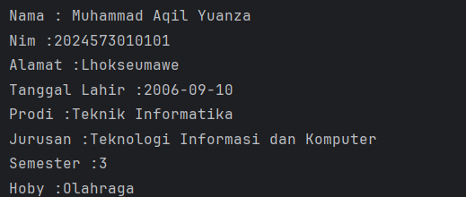

# Laporan Modul 1: Perkenalan Java dan Ekosistemnya
**Mata Kuliah:** Praktikum Pemrograman Berorientasi Objek   
**Nama:** [Muhammad Aqil Yuanza]  
**NIM:** [2024573010101]  
**Kelas:** [TI 2A]

---

## Abstrak
Java merupakan salah satu bahasa pemrograman populer yang dirancang untuk bersifat portabel, aman, dan berorientasi objek, sehingga dapat dijalankan di berbagai platform tanpa perlu perubahan kode yang signifikan. Filosofi “Write Once, Run Anywhere” memungkinkan aplikasi Java beroperasi pada beragam sistem operasi melalui Java Virtual Machine (JVM). Ekosistem Java mencakup berbagai komponen penting seperti Java Development Kit (JDK) untuk pengembangan aplikasi, Java Runtime Environment (JRE) untuk menjalankan program, serta Java Virtual Machine (JVM) sebagai mesin eksekusi. Selain itu, Java didukung oleh pustaka standar yang luas, kerangka kerja (framework) modern seperti Spring dan Hibernate, serta alat pengembangan seperti Maven, Gradle, dan berbagai IDE (Integrated Development Environment) seperti IntelliJ IDEA, Eclipse, dan NetBeans. Kombinasi bahasa yang kuat, komunitas global, dan ekosistem yang matang menjadikan Java pilihan utama dalam pengembangan aplikasi enterprise, mobile, web, hingga Internet of Things (IoT).

---

## 1. Pendahuluan
Java adalah bahasa pemrograman berorientasi objek yang dikembangkan oleh Sun Microsystems pada tahun 1995 dengan prinsip “Write Once, Run Anywhere”, memungkinkan program berjalan di berbagai platform melalui Java Virtual Machine (JVM). Java memiliki ekosistem yang luas, meliputi Java Development Kit (JDK), Java Runtime Environment (JRE), pustaka standar, serta berbagai framework seperti Spring dan Hibernate yang mendukung pengembangan aplikasi web, mobile, hingga enterprise. Dengan stabilitas, keamanan, dan dukungan komunitas global, Java tetap menjadi pilihan utama dalam membangun aplikasi modern yang andal dan portabel.

---

## 2. Proses instalasi Java
Langkah 1: Akses Website Amazon Corretto
1. Buka browser web (Chrome, Firefox, atau Edge)
2. Navigasikan ke alamat: https://aws.amazon.com/corretto/
3. Klik tombol "Download Amazon Corretto" yang terletak di bagian tengah halaman
4. Anda akan diarahkan ke halaman download yang menampilkan berbagai versi yang tersedia
   
Langkah 2: Pilih Versi JDK yang Tepat
1. Pada halaman download, pilih Amazon Corretto 17 atau Amazon Corretto 21 (keduanya adalah Long Term Support version)
2. Untuk pembelajaran pemula, Corretto 17 sangat direkomendasikan karena stabilitas dan compatibility yang baik
3. Pastikan Anda memilih versi yang sesuai dengan arsitektur sistem operasi:
Windows x64: Untuk Windows 64-bit (paling umum)
Windows x86: Untuk Windows 32-bit (jarang digunakan)
macOS x64: Untuk Mac dengan processor Intel
macOS aarch64: Untuk Mac dengan Apple Silicon (M1/M2)
Linux x64: Untuk distribusi Linux 64-bit

Langkah 3: Download Installer
1. Klik pada link download yang sesuai dengan sistem operasi Anda
2. Pilih format installer:
Windows: File dengan ekstensi .msi (Microsoft Installer)
macOS: File dengan ekstensi .pkg (Package Installer)
Linux: File dengan ekstensi .deb (untuk Ubuntu/Debian) atau .rpm (untuk RedHat/CentOS)
3. Tunggu proses download selesai (ukuran file sekitar 200-300 MB)
4. Pastikan lokasi download mudah diakses (biasanya folder Downloads)

Langkah 4: Instalasi di Windows
1. Buka File Explorer dan navigasikan ke folder Downloads
2. Double-click file installer Amazon Corretto (contoh: amazon-corretto-17-x64-windows-jdk.msi)
3. Jika muncul dialog "User Account Control", klik "Yes" untuk memberikan permission
4. Pada welcome screen installer, klik "Next"
5. Baca dan setujui License Agreement dengan mencentang "I accept the terms in the License Agreement", kemudian klik "Next"
6. Pada halaman "Custom Setup", biarkan semua komponen tercentang (default installation), klik "Next"
7. Catat dengan teliti installation path yang ditampilkan (biasanya: C:\Program Files\Amazon Corretto\jdk17.x.x_xx\)
8. Klik "Install" untuk memulai proses instalasi
9. Tunggu proses instalasi selesai (biasanya 2-5 menit)
10. Klik "Finish" untuk menyelesaikan instalasi

Langkah 5: Instalasi di macOS
1. Buka Finder dan navigasikan ke folder Downloads
2. Double-click file installer Amazon Corretto (contoh: amazon-corretto-17-macos-x64.pkg)
3. Pada introduction screen, klik "Continue"
4. Baca License Agreement dan klik "Continue", kemudian "Agree"
5. Pilih destination disk (biasanya Macintosh HD) dan klik "Continue"
6. Klik "Install" dan masukkan password administrator ketika diminta
7. Tunggu proses instalasi selesai
8. Klik "Close" untuk menyelesaikan instalasi
9. JDK akan terinstall di: /Library/Java/JavaVirtualMachines/amazon-corretto-17.jdk/

Langkah 6: Instalasi di Linux (Ubuntu/Debian)
1. Buka Terminal dengan menekan Ctrl+Alt+T
2. Navigasikan ke folder Downloads: cd ~/Downloads
3. Install paket .deb dengan command: sudo dpkg -i amazon-corretto-17-x64-linux-jdk.deb
4. Jika ada dependency issues, jalankan: sudo apt-get install -f
5. Verifikasi instalasi dengan: dpkg -l | grep corretto

Langkah 7: Verifikasi Instalasi
1. Windows: Buka Command Prompt dengan menekan Win+R, ketik cmd, tekan Enter
2. macOS: Buka Terminal dari Applications > Utilities > Terminal
3. Linux: Buka Terminal dengan Ctrl+Alt+T
4. Ketik command berikut dan tekan Enter:

         java -version

5. Output yang diharapkan akan menampilkan informasi seperti:

         openjdk version "17.0.x" 2023-xx-xx LTS
         OpenJDK Runtime Environment Corretto-17.0.x.x (build 17.0.x+xx-LTS)
         OpenJDK 64-Bit Server VM Corretto-17.0.x.x (build 17.0.x+xx-LTS, mixed mode, sharing)
6. Selanjutnya, verifikasi compiler dengan mengetik:

         javac -version
7. Output yang diharapkan:

         javac 17.0.x

Langkah 8: Setup Environment Variables (Khusus Windows)
1. Klik kanan pada "This PC" di desktop atau File Explorer, pilih "Properties"
2. Klik "Advanced system settings" di panel kiri
3. Pada dialog System Properties, klik "Environment Variables…"
4. Di bagian "System variables", klik "New…"
5. Masukkan:
Variable name: JAVA_HOME
Variable value: C:\Program Files\Amazon Corretto\jdk17.0.x_xx (sesuaikan dengan versi yang terinstall)
6. Klik "OK"
7. Cari variable "Path" di System variables, klik "Edit…"
8. Klik "New" dan tambahkan: %JAVA_HOME%\bin
9. Klik "OK" pada semua dialog yang terbuka
10. Restart Command Prompt untuk menerapkan perubahan
---

## 3. Laporan proses pembuatan program hello world dengan java
1. Buat sebuah project baru di intellj dengan memilih file -> new -> project
2. Pastikan teknology, lokasi penyimpanan sesuai. 
3. Hilangkan checklist pada tulisan Create Git repository
4. Buat sebuah java class baru dan beri nama Main dengan klik kanan pada folder src pilih new -> Java Class
5. Tuliskan kode berikut:

         public class Main {
          public static void main(String[] args) {
          System.out.println("Hello World");
          }
          }
6. Jalankan programnya dan cek hasil nya.

---

## 4. Laporan proses pembuatan program Data Diri dengan Java
1. Buat sebuah project baru di intellj dengan memilih file -> new -> project
2. Pastikan teknology, lokasi penyimpanan sesuai.
3. Hilangkan checklist pada tulisan Create Git repository
4. Buat sebuah Package baru dan beri nama DataDiri dengan klik kanan pada folder src pilih new -> Package
5. Tuliskan kode berikut:

        package DataDiri;
        
        import java.sql.SQLOutput;
        import java.time.LocalDate;
        import java.util.Date;
        
        public class DataDiri {
        public static void main(String[] args){
        System.out.println("Data diri");
        String nama = "Muhammad Aqil Yuanza";
        String nim = "2024573010101";
        String alamat ="Lhokseumawe";
        LocalDate Tgllahir = LocalDate.of(2006,9,10);
        String Prodi = "Teknik Informatika";
        String Jurusan = "Teknologi Informasi dan Komputer ";
        int semester= 3;
        String Hobi = "Olahraga";
        System.out.println("Nama : " + nama);
        System.out.println("Nim :" + nim);
        System.out.println("Alamat :" + alamat);
        System.out.println("Tanggal Lahir :" + Tgllahir);
        System.out.println("Prodi :" + Prodi);
        System.out.println("Jurusan :" + Jurusan);
        System.out.println("Semester :" + semester);
        System.out.println("Hoby :" + Hobi);
        
            }
        }

6. Jalankan programnya dan cek hasil nya.

---

## 5. Referensi
Mohd Rzu - Modul Praktikum Pemograman Berorientasi Objek Java (HackMD)
https://hackmd.io/@mohdrzu/ByrYifVFeg
