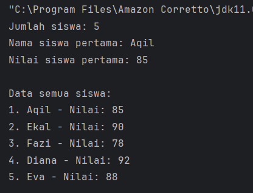
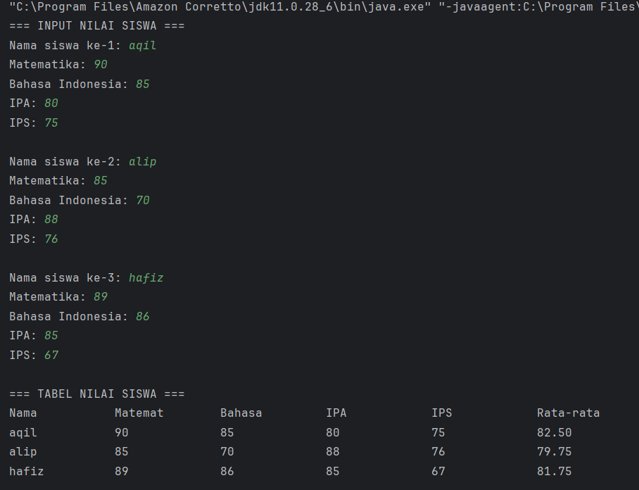
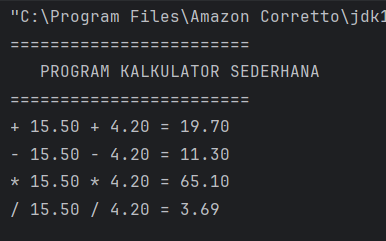
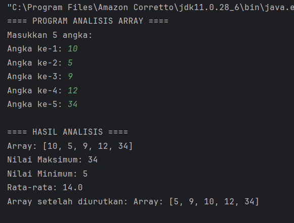
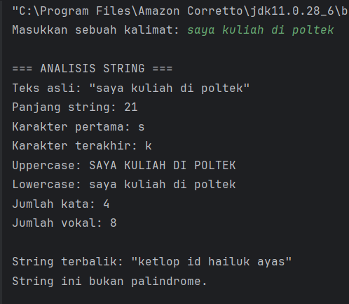
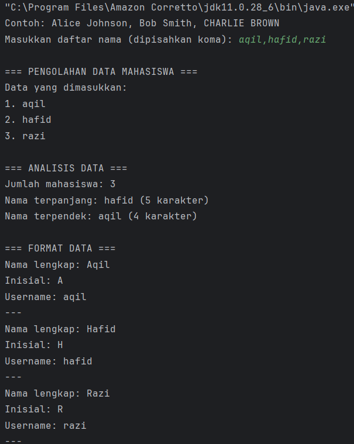

# Laporan Modul 3: Dasar Pemrograman Java
*Mata Kuliah:* Praktikum Pemrograman Berorientasi Objek

*Nama:* MUHAMMAD AQIL YUANZA

*NIM:* 2024573010101

*Kelas:* TI 2A

---
## 1. Abstrak

---
Modul ini membahas penerapan konsep dasar lanjutan dalam bahasa pemrograman Java, yaitu array, method, dan string. Ketiga konsep ini merupakan pondasi penting dalam pemrograman berorientasi objek, khususnya dalam pengelolaan data, modularisasi program, dan manipulasi teks.

Array digunakan sebagai wadah untuk menyimpan sekumpulan data dengan tipe yang sama secara terstruktur. Berdasarkan materi dari Petani Kode, array di Java bersifat statis, artinya ukuran dan tipe datanya ditentukan di awal, dengan elemen-elemen yang diakses melalui indeks dimulai dari 0. Array dapat berbentuk satu dimensi maupun dua dimensi (atau lebih), dan sering digunakan untuk menyimpan data yang terorganisasi dalam bentuk tabel atau matriks, seperti daftar nilai mahasiswa.

Selanjutnya, konsep method digunakan untuk membagi program menjadi bagian-bagian kecil yang terpisah (modular), sehingga kode menjadi lebih mudah dibaca, diuji, dan dipelihara. Method dapat berupa void (tidak mengembalikan nilai) atau non-void (mengembalikan nilai). Dengan menggunakan method, pengulangan kode dapat diminimalkan, serta logika program menjadi lebih rapi dan terstruktur.

Sementara itu, string digunakan untuk memproses dan memanipulasi data teks. Dalam Java, string adalah objek yang menyediakan berbagai method seperti length(), charAt(), substring(), toUpperCase(), dan replace(). Melalui praktikum ini, mahasiswa belajar mengimplementasikan fungsi-fungsi string untuk melakukan operasi seperti pemeriksaan palindrome, penghitungan jumlah huruf vokal dan konsonan, serta pembalikan teks.

Tujuan dari praktikum ini adalah agar mahasiswa mampu memahami dan menerapkan penggunaan array dalam berbagai bentuk, menguasai konsep modularisasi melalui method, serta dapat mengelola dan memanipulasi string secara efisien. Melalui kombinasi ketiga konsep ini, mahasiswa diharapkan dapat menulis program yang lebih sistematis, terstruktur, dan mudah dikembangkan untuk kebutuhan aplikasi yang lebih kompleks.
## 2. Praktikum
### Praktikum 1 - Array
### 1.1 ArraySatuDimensi
##### Dasar Teori
Array merupakan salah satu struktur data dasar yang sangat penting dalam dunia pemrograman. Secara umum, array digunakan untuk menyimpan sejumlah data dengan tipe yang sama di dalam satu variabel. Dengan adanya array, seorang programmer dapat mengelola data dalam jumlah besar dengan cara yang lebih efisien dan terstruktur dibandingkan dengan menggunakan banyak variabel terpisah. Konsep utama dari array adalah bahwa data yang disimpan memiliki indeks, yaitu penanda posisi yang digunakan untuk mengakses setiap elemen di dalam array. Indeks ini umumnya dimulai dari angka 0, sehingga elemen pertama array memiliki indeks 0, elemen kedua memiliki indeks 1, dan seterusnya.

Array memiliki berbagai jenis, salah satunya adalah array satu dimensi. Array satu dimensi merupakan bentuk paling sederhana dari array, di mana hanya terdapat satu baris atau satu urutan elemen yang tersimpan. Setiap elemen hanya diakses dengan satu indeks tunggal, yang menunjukkan posisi elemen tersebut dalam urutan. Oleh karena itu, array satu dimensi sering disebut juga dengan istilah linear array, karena elemen-elemen di dalamnya tersusun secara berurutan dalam satu garis lurus di memori komputer.

Dalam implementasinya, array satu dimensi dapat digunakan untuk menyimpan berbagai jenis data, seperti angka, teks, maupun karakter, selama semua elemen memiliki tipe data yang sama. Misalnya, jika sebuah array digunakan untuk menyimpan nilai-nilai ujian, maka seluruh elemen di dalamnya harus berupa angka (integer atau float). Hal ini penting karena array menyimpan data secara homogen, berbeda dengan struktur data lain seperti list atau object yang dapat menampung berbagai tipe data sekaligus.

#### Langkah Praktikum
1. Buat project baru

    Buat sebuah project dengan nama yang sesuai, misalnya Modul_3.
2. Buat package baru

   Buat package bernama modul_3 untuk menyimpan file program. Package digunakan untuk mengelompokkan kelas dalam struktur yang teratur.
3. Buat file Java baru

   Di dalam package modul_3, buat sebuah file baru dengan nama ArraySatuDimensi.java
4. Deklarasikan kelas dan method utama
5. Deklarasi dan inisialisasi array

   Buat dua buah array:

   nilai (tipe int) untuk menyimpan data nilai siswa.

   nama (tipe String) untuk menyimpan nama siswa.

6. Menampilkan panjang array

   Gunakan properti .length untuk mengetahui jumlah elemen pada array:
7. Mengakses elemen array secara langsung

   Tampilkan elemen tertentu menggunakan indeks, misalnya elemen pertama (indeks ke-0):
8. Menampilkan seluruh elemen array menggunakan perulangan for

   Gunakan perulangan untuk menampilkan semua data nama dan nilai siswa:
9. Jalankan program

   Simpan file, kemudian jalankan program.

#### Screenshoot Hasil

### 1.2 Array Dua Dimensi
#### Dasar Teori
Array dua dimensi adalah salah satu bentuk lanjutan dari struktur data array satu dimensi, di mana data disusun dalam baris dan kolom menyerupai tabel atau matriks. Jika array satu dimensi hanya memiliki satu indeks untuk mengakses setiap elemen, maka pada array dua dimensi digunakan dua indeks, yaitu indeks baris dan indeks kolom. Dengan kata lain, array dua dimensi adalah array dari array, yang memungkinkan penyimpanan data dalam bentuk grid atau kotak.

Secara konseptual, array dua dimensi dapat dibayangkan seperti tabel dengan beberapa baris dan beberapa kolom. Setiap elemen di dalam array terletak pada posisi tertentu yang ditentukan oleh koordinat baris dan kolom. Misalnya, array[0][0] menunjukkan elemen yang berada di baris pertama dan kolom pertama, sedangkan array[1][2] berarti elemen yang berada pada baris kedua dan kolom ketiga.

Array dua dimensi digunakan untuk menyimpan dan mengelola data yang memiliki hubungan dalam dua arah, seperti data tabel nilai mahasiswa (nama vs mata kuliah), data piksel pada gambar, papan permainan (seperti catur), hingga matriks matematika. Karena fleksibilitasnya, array dua dimensi sering dipakai dalam berbagai aplikasi yang memerlukan representasi data dalam bentuk baris dan kolom.
#### Langkah Praktikum
1. Buat file Java baru

   Di dalam package tersebut, buat file dengan nama ArrayDuaDimensi.java.
2. Import library Scanner

   Tambahkan baris import java.util.Scanner; di bagian atas untuk memungkinkan input dari pengguna melalui keyboard.
3. Deklarasi kelas dan method utama
4. Deklarasi array dua dimensi dan array pendukung

    Buat array dua dimensi nilaiSiswa[3][4] untuk menyimpan nilai 3 siswa terhadap 4 mata pelajaran.

    Buat array satu dimensi namaSiswa[3] untuk menyimpan nama siswa.

    Buat array mataPelajaran untuk menampung daftar nama mata pelajaran.
5. Input data siswa dan nilai

   Gunakan perulangan for bersarang (nested loop) untuk menginput nama dan nilai siswa:
6. Menghitung rata-rata nilai setiap siswa

   Untuk setiap siswa, jumlahkan seluruh nilai kemudian bagi dengan jumlah mata pelajaran (4):
7. Jalankan program

#### Screenshoot Hasil

#### Analisa dan Pembahasan
Pada praktikum ini, konsep array satu dimensi dan dua dimensi digunakan untuk memahami cara penyimpanan serta pengolahan data dalam bentuk terstruktur. Pada array satu dimensi, data disimpan dalam satu urutan dan diakses menggunakan satu indeks. Hal ini memudahkan pengelolaan banyak data dengan tipe yang sama, seperti daftar nama atau nilai. Melalui penggunaan perulangan for, seluruh elemen dapat ditampilkan atau diolah secara efisien tanpa perlu menulis kode berulang.

Sementara itu, array dua dimensi merupakan pengembangan dari array satu dimensi yang memiliki dua indeks, yaitu baris dan kolom. Struktur ini memungkinkan penyimpanan data dalam bentuk tabel, seperti nilai beberapa siswa pada beberapa mata pelajaran. Dengan perulangan bersarang (for ganda), setiap elemen dapat diakses dan ditampilkan secara teratur.

Dari hasil percobaan, keduanya menunjukkan bahwa array sangat membantu dalam menyimpan dan mengolah data secara efisien. Array satu dimensi cocok untuk data berurutan, sedangkan array dua dimensi lebih tepat untuk data tabular. Dengan demikian, penggunaan array menjadikan program lebih terstruktur, mudah dibaca, dan efisien dalam pemrosesan data.

### Praktikum 2 - Method
### 2.1 Method Dasar
#### Dasar Teori
Dalam pemrograman, method (atau sering disebut fungsi) adalah suatu blok kode yang dirancang untuk menjalankan tugas tertentu dan dapat dipanggil kapan pun dibutuhkan. Method merupakan salah satu konsep penting dalam pemrograman terstruktur dan berorientasi objek karena membantu memecah program besar menjadi bagian-bagian kecil yang lebih mudah dipahami, diuji, dan digunakan kembali (reusable).

Secara umum, method berfungsi untuk mengelompokkan perintah yang memiliki tujuan sama agar tidak perlu ditulis berulang kali. Dengan cara ini, program menjadi lebih efisien, terstruktur, dan mudah dalam proses perawatan (maintenance). Setiap method memiliki nama, parameter (opsional), dan nilai kembalian (return value) tergantung dari tujuan method tersebut.

#### Langkah Praktikum
1. Buat file Java baru

Di dalam package tersebut, buat file dengan nama MethodDasar.java
2. Deklarasikan kelas utama dan method main()
3. Buat method tanpa parameter dan tanpa nilai kembali (void)

   Method ini berfungsi menampilkan header program.
4. Buat method void dengan parameter

   Method ini menerima beberapa parameter untuk menampilkan hasil operasi perhitungan.
5. Buat method dengan nilai kembali (return value)

   Buat beberapa method untuk operasi dasar aritmatika: penjumlahan, pengurangan, perkalian, dan pembagian.
6. Tambahkan method untuk validasi input

   Method ini memeriksa apakah angka valid (bukan NaN atau tak hingga).
7. Gunakan semua method di dalam main()

   Di dalam method main(), panggil semua method yang sudah dibuat untuk dijalankan secara berurutan
8. Jalankan program

#### Screenshoot Hasil

### 2.2 Method Array
#### Dasar Teori
Dalam pemrograman, method dan array merupakan dua konsep dasar yang saling berkaitan dan sering digunakan bersamaan untuk memudahkan pengelolaan serta pengolahan data.

Kombinasi antara method dan array memungkinkan programmer untuk mengelola data dalam jumlah besar dengan lebih mudah. Misalnya, method dapat digunakan untuk menampilkan isi array, menghitung rata-rata nilai dari elemen array, mencari elemen tertentu, atau melakukan operasi matematika pada seluruh isi array. Dengan demikian, penggunaan method membantu menghindari pengulangan kode dan meningkatkan efisiensi program.

#### Langkah Praktikum
1. Buat file Java baru

   Di dalam package tersebut, buat file dengan nama ArrayMethod.java.
2. Import library Scanner

   Tambahkan perintah berikut di bagian atas program untuk menerima input dari pengguna:
3. Buat class utama dan method main()
4. Buat method untuk input array

   Method ini berfungsi meminta pengguna memasukkan sejumlah nilai ke dalam array.
5. Buat method untuk menampilkan isi array

   Method ini menampilkan semua elemen array dalam satu baris.
6. Buat method untuk mencari nilai maksimum dan minimum

   Method ini mencari nilai tertinggi dan terendah dalam array.
7. Buat method untuk menghitung rata-rata

   Method ini menjumlahkan seluruh elemen lalu membaginya dengan jumlah elemen array.
8. Buat method untuk mengurutkan array

   Method ini menggunakan algoritma Bubble Sort untuk menyusun elemen dari kecil ke besar.
9. Gunakan semua method di dalam main()

   Jalankan semua fungsi di method utama agar program bisa menganalisis isi array.
10. Jalankan program

#### Screenshoot Hasil

#### Analisa dan Pembahasan
Pada praktikum ini, dilakukan penerapan konsep method dasar dan method array dalam bahasa pemrograman Java. Tujuan utama dari percobaan ini adalah memahami bagaimana cara kerja method sebagai blok kode yang dapat dipanggil berulang kali, serta bagaimana method dapat digunakan untuk mengolah data yang tersimpan dalam array.

Pada program method dasar, setiap method memiliki fungsi tersendiri, seperti menampilkan pesan, melakukan perhitungan, hingga mengembalikan nilai hasil operasi. Dengan menggunakan method, kode program menjadi lebih terstruktur dan efisien karena setiap tugas dipisahkan ke dalam fungsi khusus. Misalnya, method tambah(), kurang(), kali(), dan bagi() digunakan untuk melakukan operasi aritmetika, sementara tampilkanHeader() dan tampilkanHasil() digunakan untuk menampilkan informasi ke layar. Hasil percobaan menunjukkan bahwa penggunaan method mempermudah proses pemanggilan dan pemeliharaan program tanpa perlu menulis ulang logika yang sama.

---
### Praktikum 3 - String
### 3.1 String Dasar
#### Dasar Teori
Dalam pemrograman, string merupakan salah satu tipe data yang digunakan untuk menyimpan kumpulan karakter atau teks, seperti huruf, angka, dan simbol. String biasanya digunakan untuk menampilkan pesan, menyimpan nama, kalimat, maupun data yang berbentuk teks. Berbeda dengan tipe data numerik seperti int atau double, string tidak digunakan untuk perhitungan aritmatika, melainkan untuk pengolahan kata dan kalimat.

Dalam bahasa pemrograman Java, string termasuk dalam kelas (class) bawaan yang bernama String, bukan tipe data primitif. Artinya, setiap string di Java adalah sebuah objek dari kelas String. Karena bersifat objek, string memiliki berbagai method (fungsi bawaan) yang dapat digunakan untuk memanipulasi teks, seperti menghitung panjang string, mengubah huruf besar atau kecil, mengambil sebagian teks, membandingkan isi string, dan lain-lain.

#### Langkah Praktikum
1. Buat file Java baru

   Buat file bernama StringDasar.java di dalam package tersebut.
2. Import library Scanner

   Tambahkan library berikut di bagian atas program untuk menerima input dari pengguna
3. Buat method analisisString()

   Method ini berfungsi untuk menampilkan informasi dasar dari string, seperti panjang karakter, huruf pertama, huruf terakhir, huruf besar, huruf kecil, jumlah kata, dan jumlah huruf vokal.
4. Buat method hitungVokal()

   Method ini menghitung jumlah huruf vokal (a, i, u, e, o) dari sebuah kalimat.
5. Buat method reverseString()

   Method ini digunakan untuk membalik urutan karakter dalam string.
6. Buat method isPalindrome()

   Method ini digunakan untuk mengecek apakah sebuah kalimat merupakan palindrome (dibaca sama dari depan maupun belakang).
7. Tulis method main() untuk menjalankan semua fungsi
8. Jalankan program

#### Screenshoot Hasil

### 3.2 Text Processing
#### Dasar Teori
Text Processing atau pemrosesan teks adalah suatu teknik dalam pemrograman yang digunakan untuk membaca, menganalisis, memanipulasi, dan mengolah data berbentuk teks. Dalam dunia komputer, sebagian besar informasi disimpan dalam bentuk teks — seperti dokumen, pesan, data log, atau masukan pengguna — sehingga kemampuan untuk mengolah teks menjadi hal yang sangat penting.

Dalam pemrograman, pemrosesan teks biasanya melibatkan operasi seperti pencarian kata atau karakter, penggantian teks, penghitungan jumlah kata, pemisahan kalimat, penghapusan tanda baca, hingga pemeriksaan pola tertentu menggunakan regular expression (regex). Dengan text processing, program dapat mengambil informasi penting dari teks mentah dan mengubahnya menjadi data yang lebih terstruktur dan mudah dianalisis.

#### Langkah Praktikum
1. Buat file Java baru

   Di dalam package tersebut, buat file baru dengan nama TextProcessing.java.
2. Import library Scanner

   Tambahkan baris berikut di bagian atas kode untuk menerima input dari pengguna:
3. Buat method prosesDataMahasiswa()
4. Analisis nama terpanjang dan terpendek

   Gunakan perulangan for untuk mencari nama dengan jumlah karakter paling banyak dan paling sedikit
5. Buat method formatTitleCase()

   Method ini mengubah setiap nama menjadi format huruf besar di awal kata.
6. Buat method buatInisial()

   Method ini mengambil huruf pertama dari setiap kata dalam nama untuk dijadikan inisial.
7. Buat method buatUsername()

   Method ini membuat username berdasarkan kata pertama dari nama mahasiswa.
8. Panggil semua method di dalam main()

   Program meminta pengguna memasukkan daftar nama yang dipisahkan dengan koma, lalu memproses data menggunakan method-method di atas.
9. Jalankan program

#### Screenshoot Hasil

#### Analisa dan Pembahasan
Pada praktikum String Dasar ini, dilakukan percobaan untuk memahami cara kerja tipe data String dalam bahasa pemrograman Java serta berbagai method bawaan (fungsi) yang dapat digunakan untuk memanipulasi teks. Program ini menggunakan beberapa method untuk menganalisis sebuah kalimat yang diinput oleh pengguna.

Dari percobaan ini dapat disimpulkan bahwa kelas String di Java menyediakan banyak method penting untuk manipulasi teks. Penggunaan method tersebut membuat pengolahan data menjadi lebih mudah, efisien, dan fleksibel. Dengan memahami konsep dasar string dan berbagai fungsinya, programmer dapat mengelola input teks secara dinamis serta membangun aplikasi yang melibatkan pemrosesan kalimat atau kata dengan lebih efektif.

## 3. Kesimpulan
Berdasarkan hasil praktikum yang telah dilakukan dari materi Array, Method, hingga String, dapat disimpulkan bahwa ketiga konsep tersebut merupakan dasar utama dalam pemrograman Java yang saling berkaitan dan membentuk pondasi logika pemrograman yang kuat. Melalui materi Array, mahasiswa memahami bagaimana cara menyimpan dan mengelola sekumpulan data dengan tipe yang sama secara efisien. Array memungkinkan data diakses dan dimodifikasi menggunakan indeks, sehingga sangat berguna dalam pengolahan data berjumlah banyak, seperti daftar nilai, data mahasiswa, atau elemen numerik lainnya.
Selanjutnya, pada materi Method, mahasiswa belajar bagaimana memecah program menjadi bagian-bagian kecil yang disebut fungsi atau prosedur. Penggunaan method menjadikan kode lebih terstruktur, mudah dibaca, dan dapat digunakan kembali tanpa perlu menulis ulang logika yang sama. Method juga mendukung penggunaan parameter dan nilai kembalian (return value), sehingga logika program dapat dikembangkan secara modular dan fleksibel. Dengan memahami konsep method, mahasiswa dapat membangun program yang efisien dan mudah dikelola sesuai prinsip pemrograman terstruktur maupun berorientasi objek (OOP).
Kemudian pada materi String, mahasiswa mempelajari cara mengolah dan memanipulasi data teks menggunakan kelas String serta berbagai method bawaannya. Melalui latihan seperti menghitung panjang teks, mengubah huruf besar-kecil, membalik string, menghitung huruf vokal, memeriksa palindrome, dan mencari kata dalam kalimat, mahasiswa memahami bahwa Java menyediakan banyak fasilitas untuk bekerja dengan data teks secara efisien. Selain itu, konsep immutability pada String memberikan pemahaman penting tentang cara kerja memori dan pengelolaan objek di Java.
Secara keseluruhan, ketiga materi ini mengajarkan prinsip penting dalam pemrograman yaitu pengelolaan data, modularisasi kode, dan manipulasi informasi. Dengan menguasai Array, Method, dan String, mahasiswa memiliki bekal yang kuat untuk melanjutkan ke tingkat pemrograman yang lebih kompleks seperti penggunaan kelas dan objek, struktur data lanjutan, serta pengembangan aplikasi berbasis data. Praktikum ini juga menumbuhkan kemampuan analitis dan logis dalam menyelesaikan masalah secara sistematis dengan menggunakan bahasa pemrograman Java.

---

## 4.Referensi
Duniailkom.
Tutorial Belajar Java: Tipe Data Array dalam Bahasa Pemrograman Java.
Diakses dari: https://www.duniailkom.com/tutorial-belajar-java-tipe-data-array-bahasa-pemrograman-java/

Petani Kode.
Belajar Java: Mengenal Array di Java.
Diakses dari: https://www.petanikode.com/java-array/

W3Schools.
Java Methods and Strings Tutorial.
Diakses dari: https://www.w3schools.com/java/

Modul Praktikum Java – HackMD (mohdrzu).
Modul Praktikum 3: Array, Method, dan String.
Diakses dari: https://hackmd.io/@mohdrzu/BJBWepc3xg
---