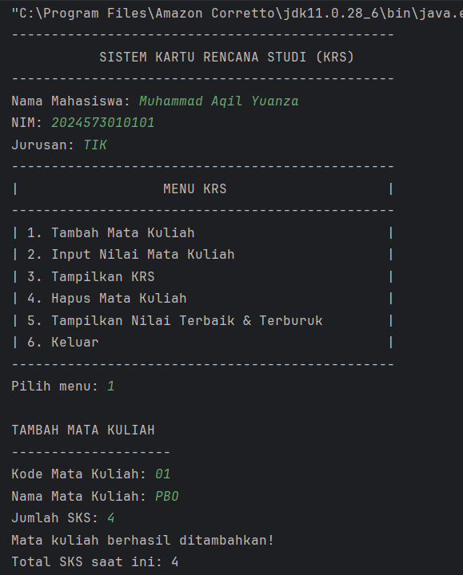
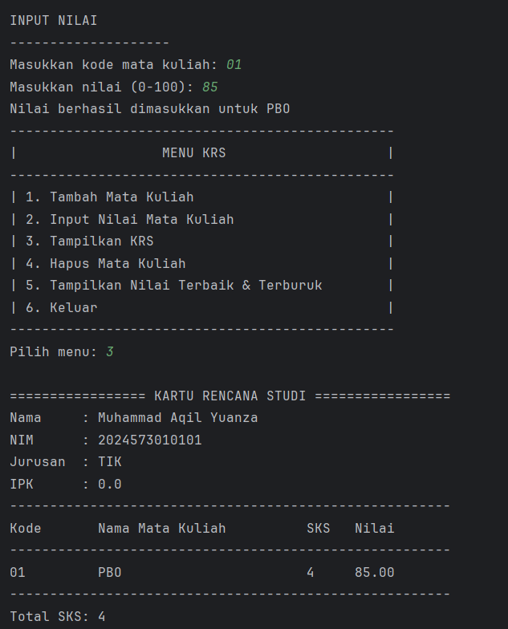
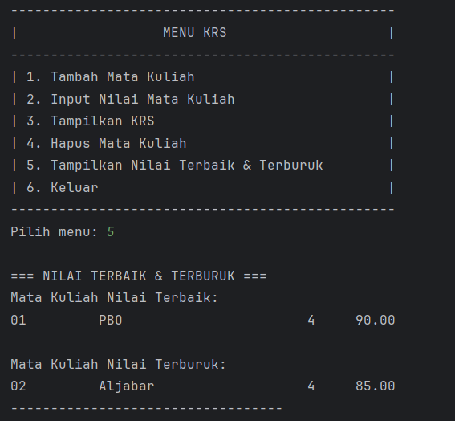
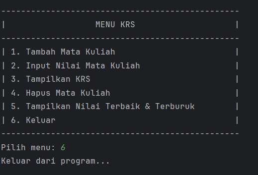

# Laporan Modul 4: Pengenalan Object Oriented Programming
*Mata Kuliah:* Praktikum Pemrograman Berorientasi Objek   
*Nama:* [Muhammad Aqil Yuanza]  
*NIM:* [2024573010101]  
*Kelas:* [TI2A]

## 1. Abstrak
Objek-Oriented Programming (OOP) adalah paradigma pemrograman yang menggunakan “objek” - struktur data yang berisi data, dalam bentuk field, sering kali dikenal sebagai atribut; dan kode, dalam bentuk prosedur, sering kali dikenal sebagai metode.
Inti dari OOP adalah mendesain software dengan membagi masalah menjadi serangkaian objek yang saling berinteraksi. Ini bertentangan dengan pemrograman prosedural, yang fokus pada fungsi/prosedur dalam memproses data. OOP memungkinkan kita untuk membuat kode yang lebih modular, reusable, dan mudah di-maintain.
## 2. Praktikum
#### Langkah Praktikum

1. Buat class Mahasiswa dan isikan kode berikut:

        package modul_4;

         public class Mahasiswa {
        // Atribut/Field (private untuk encapsulation)
            private String nama;
         private String nim;
         private String jurusan;

        // Constructor dengan parameter
        public Mahasiswa(String nama, String npm, String jurusan, double ipk) {
            this.nama = nama;
            this.nim = npm;
            this.jurusan = jurusan;
        }

        // Getter methods
        public String getNama() {
            return nama;
        }

        public String getNim() {
            return nim;
        }

        public String getJurusan() {
            return jurusan;
        }
         }

2. Buat class Matakuliah dan isikan kode berikut:

        package modul_4;
        
        public class Matakuliah {
        private String kode;
        private String nama;
        private int sks;
        private double nilai;

        // Constructor
        public Matakuliah(String kode, String nama, int sks) {
            this.kode = kode;
            this.nama = nama;
            this.sks = sks;
            this.nilai = 0.0;
        }

        // Getter dan Setter
        public String getKode() {
            return kode;
        }

        public String getNama() {
            return nama;
        }

        public int getSks() {
            return sks;
        }

        public double getNilai() {
            return nilai;
        }

        public void setNilai(double nilai) {
            if (nilai >= 0.0 && nilai <= 100.0) {
                this.nilai = nilai;
            } else {
                System.out.println("Nilai harus antara 0-100");
            }
        }

        // Konversi nilai angka ke huruf
        public String getNilaiHuruf() {
            if (nilai > 85) return "A";
            else if (nilai > 80) return "A-";
            else if (nilai > 75) return "B+";
            else if (nilai > 70) return "B";
            else if (nilai > 65) return "B-";
            else if (nilai > 60) return "C+";
            else if (nilai > 55) return "C";
            else if (nilai > 50) return "D";
            else return "E";
        }

        // Konversi nilai huruf ke bobot
        public double getBobotNilai() {
            String huruf = getNilaiHuruf();
            switch (huruf) {
                case "A": return 4.0;
                case "A-": return 3.7;
                case "B+": return 3.3;
                case "B": return 3.0;
                case "B-": return 2.7;
                case "C+": return 2.3;
                case "C": return 2.0;
                case "D": return 1.0;
                default: return 0.0;
            }
        }

        public void tampilkanInfo() {
            System.out.printf("%-10s %-30s %d SKS | Nilai: %.2f (%s)\n",
                    kode, nama, sks, nilai, getNilaiHuruf());
        }
         }
3. Buat class RencanaKartuStudi dan isikan kode berikut:

         package modul_4;

         public class RencanaKartuStudi {
          private Mahasiswa mahasiswa;
         private Matakuliah[] daftarMatakuliah;
         private int jumlahMatkul;
         private int maxMatkul;
         private final int BATAS_SKS = 24; // Batas total SKS

        public RencanaKartuStudi(Mahasiswa mahasiswa, int maxMatkul) {
            this.mahasiswa = mahasiswa;
            this.maxMatkul = maxMatkul;
            this.daftarMatakuliah = new Matakuliah[maxMatkul];
            this.jumlahMatkul = 0;
        }
    
        // Menambah mata kuliah ke KRS (dengan validasi total SKS)
        public void tambahMatakuliah(Matakuliah matkul) {
            int totalBaru = getTotalSKS() + matkul.getSks();

        if (jumlahMatkul >= maxMatkul) {
            System.out.println("KRS sudah penuh! Maksimal " + maxMatkul + " mata kuliah.");
        } else if (totalBaru > BATAS_SKS) {
            System.out.println(" Gagal menambah. Total SKS melebihi batas " + BATAS_SKS + ".");
        } else {
            daftarMatakuliah[jumlahMatkul] = matkul;
            jumlahMatkul++;
            System.out.println(" Mata kuliah " + matkul.getNama() + " berhasil ditambahkan.");
        }
            }
        
            // Menghapus mata kuliah berdasarkan kode
            public void hapusMatakuliah(String kode) {
                boolean ditemukan = false;
                for (int i = 0; i < jumlahMatkul; i++) {
                    if (daftarMatakuliah[i].getKode().equalsIgnoreCase(kode)) {
                        ditemukan = true;
                        System.out.println(" Mata kuliah " + daftarMatakuliah[i].getNama() + " dihapus dari KRS.");
                        // Geser elemen ke kiri untuk menutup celah
                        for (int j = i; j < jumlahMatkul - 1; j++) {
                            daftarMatakuliah[j] = daftarMatakuliah[j + 1];
                        }
                        daftarMatakuliah[jumlahMatkul - 1] = null;
                        jumlahMatkul--;
                        break;
                    }
                }
                if (!ditemukan) {
                    System.out.println(" Mata kuliah dengan kode " + kode + " tidak ditemukan.");
                }
            }
        
            // Menghitung total SKS
            public int getTotalSKS() {
                int total = 0;
                for (int i = 0; i < jumlahMatkul; i++) {
                    total += daftarMatakuliah[i].getSks();
                }
                return total;
            }
        
            // Menghitung IPS sementara
            public double hitungIPS() {
                double totalBobot = 0.0;
                double totalSKS = getTotalSKS();

        if (jumlahMatkul == 0) return 0.0;

        for (int i = 0; i < jumlahMatkul; i++) {
            totalBobot += daftarMatakuliah[i].getBobotNilai() * daftarMatakuliah[i].getSks();
        }

        return totalSKS > 0 ? totalBobot / totalSKS : 0.0;
        }
    
        // Menampilkan data KRS
        public void tampilkanKRS() {
            System.out.println("============================================");
            System.out.println("           KARTU RENCANA STUDI (KRS)");
            System.out.println("============================================");
            System.out.println("NIM   : " + mahasiswa.getNim());
            System.out.println("Nama  : " + mahasiswa.getNama());
            System.out.println("Prodi : " + mahasiswa.getJurusan());
            System.out.println("--------------------------------------------");
            System.out.printf("%-10s %-30s %s\n", "Kode", "Nama Mata Kuliah", "SKS NILAI");
            System.out.println("--------------------------------------------");

        for (int i = 0; i < jumlahMatkul; i++) {
            daftarMatakuliah[i].tampilkanInfo();
        }

        System.out.println("--------------------------------------------");
        System.out.println("Total SKS: " + getTotalSKS());
        System.out.printf("IPS Semester Ini: %.2f\n", hitungIPS());
        System.out.println("============================================\n");
        }
    
        // Mencari mata kuliah berdasarkan kode
        public Matakuliah cariMatakuliah(String kode) {
            for (int i = 0; i < jumlahMatkul; i++) {
                if (daftarMatakuliah[i].getKode().equalsIgnoreCase(kode)) {
                    return daftarMatakuliah[i];
                }
            }
            return null;
        }
    
        // Menampilkan mata kuliah dengan nilai terbaik
        public void tampilkanNilaiTerbaik() {
            if (jumlahMatkul == 0) {
                System.out.println("Belum ada mata kuliah dalam KRS.");
                return;
            }

        Matakuliah terbaik = daftarMatakuliah[0];
        for (int i = 1; i < jumlahMatkul; i++) {
            if (daftarMatakuliah[i].getNilai() > terbaik.getNilai()) {
                terbaik = daftarMatakuliah[i];
            }
        }
        System.out.println(" Mata kuliah dengan nilai terbaik: " + terbaik.getNama() +
                " (" + terbaik.getNilai() + " - " + terbaik.getNilaiHuruf() + ")");
        }
    
        // Menampilkan mata kuliah dengan nilai terburuk
        public void tampilkanNilaiTerburuk() {
            if (jumlahMatkul == 0) {
                System.out.println("Belum ada mata kuliah dalam KRS.");
                return;
            }

        Matakuliah terburuk = daftarMatakuliah[0];
        for (int i = 1; i < jumlahMatkul; i++) {
            if (daftarMatakuliah[i].getNilai() < terburuk.getNilai()) {
                terburuk = daftarMatakuliah[i];
            }
        }
        System.out.println(" Mata kuliah dengan nilai terburuk: " + terburuk.getNama() +
                " (" + terburuk.getNilai() + " - " + terburuk.getNilaiHuruf() + ")");
            }
        }
4. Buat class Main untuk menguji:

        package modul_4;

        import java.util.Scanner;
    
        public class Main {
            public static void main(String[] args) {
                Scanner input = new Scanner(System.in);

            System.out.println("------------------------------------------------------------");
            System.out.println("           SISTEM KARTU RENCANA STUDI (KRS)                ");
            System.out.println("------------------------------------------------------------");

            // Input data mahasiswa
            System.out.print("Nama Mahasiswa: ");
            String nama = input.nextLine();

            System.out.print("NIM: ");
            String nim = input.nextLine();

            System.out.print("Jurusan: ");
            String jurusan = input.nextLine();

            // Membuat object mahasiswa
            Mahasiswa mhs = new Mahasiswa(nama, nim, jurusan, 0.0);

            // Membuat object KRS (maksimal 10 mata kuliah)
            RencanaKartuStudi krs = new RencanaKartuStudi(mhs, 10);

            // Menu KRS
            boolean running = true;

            while (running) {
                System.out.println("------------------------------------------------------------");
                System.out.println("                        MENU KRS                            ");
                System.out.println("------------------------------------------------------------");
                System.out.println("| 1. Tambah Mata Kuliah                                   |");
                System.out.println("| 2. Input Nilai Mata Kuliah                              |");
                System.out.println("| 3. Tampilkan KRS                                        |");
                System.out.println("| 4. Keluar                                               |");
                System.out.println("| 5. Hapus Mata Kuliah                                    |");
                System.out.println("| 6. Tampilkan Nilai Terbaik & Terburuk                   |");
                System.out.println("------------------------------------------------------------");
                System.out.print("Pilih menu: ");

                int pilihan = input.nextInt();
                input.nextLine(); // consume newline

                switch (pilihan) {
                    case 1:
                        // Tambah mata kuliah
                        System.out.println("\nTAMBAH MATA KULIAH");
                        System.out.println("--------------------");
                        System.out.print("Kode Mata Kuliah: ");
                        String kode = input.nextLine();

                        System.out.print("Nama Mata Kuliah: ");
                        String namaMK = input.nextLine();

                        System.out.print("Jumlah SKS: ");
                        int sks = input.nextInt();
                        input.nextLine();

                        Matakuliah mk = new Matakuliah(kode, namaMK, sks);
                        krs.tambahMatakuliah(mk);
                        break;

                    case 2:
                        // Input nilai
                        System.out.println("\nINPUT NILAI");
                        System.out.println("--------------------");
                        System.out.print("Kode Mata Kuliah: ");
                        String kodeCari = input.nextLine();

                        Matakuliah mkCari = krs.cariMatakuliah(kodeCari);
                        if (mkCari != null) {
                            System.out.print("Nilai (0-100): ");
                            double nilai = input.nextDouble();
                            mkCari.setNilai(nilai);
                            System.out.println("Nilai berhasil diinput!");
                        } else {
                            System.out.println("Mata kuliah tidak ditemukan!");
                        }
                        break;

                    case 3:
                        // Tampilkan KRS
                        krs.tampilkanKRS();
                        break;

                    case 4:
                        // Keluar
                        System.out.println("Terima kasih!");
                        running = false;
                        break;

                    case 5:
                        System.out.print("Masukkan kode mata kuliah yang ingin dihapus: ");
                        String kodeHapus = input.nextLine();
                        krs.hapusMatakuliah(kodeHapus);
                        break;

                    case 6:
                        krs.tampilkanNilaiTerbaik();
                        krs.tampilkanNilaiTerburuk();
                        break;

                    default:
                        System.out.println("Pilihan tidak valid!");
                }
            }
        }
          }

#### Screenshoot Hasil

#### Analisa dan Pembahasan

1. CLASS Mahasiswa

        public class Mahasiswa {
- Mendefinisikan kelas Mahasiswa, yang akan merepresentasikan data seorang mahasiswa.

        private String nama;
        private String nim;
        private String jurusan;
- Ketiga variabel ini adalah atribut milik objek Mahasiswa.
- Bersifat private, artinya hanya bisa diakses dari dalam kelas itu sendiri.
- Ini adalah contoh encapsulation dalam OOP (Object Oriented Programming).

        public Mahasiswa(String nama, String npm, String jurusan, double ipk) {
        this.nama = nama;
        this.nim = npm;
        this.jurusan = jurusan;
        }
- Constructor digunakan untuk membuat (menginisialisasi) objek Mahasiswa baru.
- Parameter: nama, npm, dan jurusan

        public String getNama() { return nama; }
        public String getNim() { return nim; }
        public String getJurusan() { return jurusan; }
- Fungsi ini disebut getter.
- Digunakan untuk mengambil nilai atribut private dari luar kelas.

2. CLASS Matakuliah

        package modul_4;
        public class Matakuliah {
- package modul_4 → mengelompokkan kelas ini dalam modul 4.
- public class Matakuliah → membuat kelas publik bernama Matakuliah.

        private String kode;
        private String nama;
        private int sks;
        private double nilai;
- Semua atribut diberi modifier private → encapsulation, agar tidak bisa diakses langsung dari luar kelas.
- Menyimpan data penting: kode mata kuliah, nama, jumlah SKS, dan nilai angka.

        public Matakuliah(String kode, String nama, int sks) {
        this.kode = kode;
        this.nama = nama;
        this.sks = sks;
        this.nilai = 0.0;
        }
- Menginisialisasi objek Matakuliah saat dibuat.
- Nilai default nilai = 0.0 menunjukkan belum ada nilai yang dimasukkan.
  Sudah sesuai praktik baik OOP.

        public void setNilai(double nilai) {
        if (nilai >= 0.0 && nilai <= 100.0) {
        this.nilai = nilai;
        } else {
        System.out.println("Nilai harus antara 0-100");
        }
        }
- Getter mengambil nilai dari atribut.
- Setter setNilai() memiliki validasi, memastikan nilai hanya antara 0–100.
  Ini contoh data validation yang baik.

        public String getNilaiHuruf() {
        if (nilai > 85) return "A";
        else if (nilai > 80) return "A-";
        ...
        else return "E";
        }
- Mengonversi nilai angka ke huruf sesuai rentang.
- Rentang logis dan terurut dengan benar.

        public double getBobotNilai() {
        String huruf = getNilaiHuruf();
        switch (huruf) {
        case "A": return 4.0;
        ...
        default: return 0.0;
        }
        }
- Mengubah huruf menjadi bobot IPK (GPA).
- Cocok untuk perhitungan IP semester atau KHS mahasiswa.

        public void tampilkanInfo() {
        System.out.printf("%-10s %-30s %d SKS | Nilai: %.2f (%s)\n",
        kode, nama, sks, nilai, getNilaiHuruf());
        }
- Menampilkan data dengan format yang rapi menggunakan printf.

- %s, %d, %.2f digunakan untuk string, integer, dan angka desimal.

3. CLASS RencanaKartuStudi

        public RencanaKartuStudi(Mahasiswa mahasiswa, int maxMatkul) {
        this.mahasiswa = mahasiswa;
        this.maxMatkul = maxMatkul;
        this.daftarMatakuliah = new Matakuliah[maxMatkul];
        this.jumlahMatkul = 0;
        }
- Menginisialisasi objek KRS untuk 1 mahasiswa dengan kapasitas maksimal maxMatkul.

        public void tambahMatakuliah(Matakuliah matkul) {
        int totalBaru = getTotalSKS() + matkul.getSks();

        if (jumlahMatkul >= maxMatkul) {
            System.out.println("KRS sudah penuh!");
        } else if (totalBaru > BATAS_SKS) {
            System.out.println("Total SKS melebihi batas 24.");
        } else {
            daftarMatakuliah[jumlahMatkul] = matkul;
            jumlahMatkul++;
            System.out.println("Mata kuliah " + matkul.getNama() + " berhasil ditambahkan.");
        }
         }
- Fungsi ini memastikan:

    - Tidak melebihi kapasitas daftar (maxMatkul).

    - Total SKS tidak lebih dari 24.

    - Menambahkan matkul jika valid.

          public void hapusMatakuliah(String kode) {
          boolean ditemukan = false;
          for (int i = 0; i < jumlahMatkul; i++) {
          if (daftarMatakuliah[i].getKode().equalsIgnoreCase(kode)) {
          ditemukan = true;
          ...
          jumlahMatkul--;
          break;
          }
          }
          if (!ditemukan) {
          System.out.println("Mata kuliah tidak ditemukan.");
          }
          }
- Menghapus mata kuliah berdasarkan kode, lalu menggeser elemen array ke kiri agar tidak ada celah kosong.

        public int getTotalSKS() {
        int total = 0;
        for (int i = 0; i < jumlahMatkul; i++) {
        total += daftarMatakuliah[i].getSks();
        }
        return total;
        }
- Mengembalikan jumlah seluruh SKS yang diambil.

        public double hitungIPS() {
        double totalBobot = 0.0;
        double totalSKS = getTotalSKS();
        
            if (jumlahMatkul == 0) return 0.0;
        
            for (int i = 0; i < jumlahMatkul; i++) {
                totalBobot += daftarMatakuliah[i].getBobotNilai() * daftarMatakuliah[i].getSks();
            }
        
            return totalSKS > 0 ? totalBobot / totalSKS : 0.0;
        }

- Perhitungan IPS dilakukan dengan rumus standar:

  IPS = (Σ (bobot × SKS)) / total SKS

        public void tampilkanKRS() {
          System.out.println("============================================");
          System.out.println("           KARTU RENCANA STUDI (KRS)");
          ...
          for (int i = 0; i < jumlahMatkul; i++) {
          daftarMatakuliah[i].tampilkanInfo();
          }
          ...
          System.out.printf("IPS Semester Ini: %.2f\n", hitungIPS());
          }
- Menampilkan seluruh data KRS mahasiswa dengan format tabel.

        public Matakuliah cariMatakuliah(String kode) {
        for (int i = 0; i < jumlahMatkul; i++) {
        if (daftarMatakuliah[i].getKode().equalsIgnoreCase(kode)) {
        return daftarMatakuliah[i];
        }
        }
        return null;
        }
- Mengembalikan objek Matakuliah jika ditemukan.

        public void tampilkanNilaiTerbaik() {
        if (jumlahMatkul == 0) { ... }
        
            Matakuliah terbaik = daftarMatakuliah[0];
            for (int i = 1; i < jumlahMatkul; i++) {
                if (daftarMatakuliah[i].getNilai() > terbaik.getNilai()) {
                    terbaik = daftarMatakuliah[i];
                }
            }
            System.out.println("Nilai terbaik: " + terbaik.getNama() + ...);
        }

- Mencari nilai tertinggi dan terendah di array.

4. CLASS Main

          import java.util.Scanner;
- Mengimpor kelas Scanner untuk membaca input dari pengguna melalui keyboard.

        public class Main {
        public static void main(String[] args) {
        Scanner input = new Scanner(System.in);
- Membuat entry point program dan objek Scanner untuk input.

        System.out.print("Nama Mahasiswa: ");
        String nama = input.nextLine();
        
        System.out.print("NIM: ");
        String nim = input.nextLine();
        
        System.out.print("Jurusan: ");
        String jurusan = input.nextLine();
- Pengguna memasukkan identitas mahasiswa.

      Mahasiswa mhs = new Mahasiswa(nama, nim, jurusan, 0.0);

- Membuat objek mahasiswa berdasarkan data yang diinput.

      RencanaKartuStudi krs = new RencanaKartuStudi(mhs, 10);
- Membuat objek KRS untuk mahasiswa, dengan maksimal 10 mata kuliah.

PENJELASAN TIAP MENU
1. Tambah Mata Kuliah

        System.out.print("Kode Mata Kuliah: ");
        String kode = input.nextLine();
        System.out.print("Nama Mata Kuliah: ");
        String namaMK = input.nextLine();
        System.out.print("Jumlah SKS: ");
        int sks = input.nextInt();
        input.nextLine();

- Pengguna mengisi data mata kuliah.

        Matakuliah mk = new Matakuliah(kode, namaMK, sks);
        krs.tambahMatakuliah(mk);
- Menambahkan mata kuliah ke daftar KRS melalui method tambahMatakuliah().
- Method tersebut juga sudah memiliki validasi:

  Tidak melebihi batas jumlah matkul,

  Tidak melebihi batas total SKS (24 SKS).

        System.out.print("Kode Mata Kuliah: ");
            String kodeCari = input.nextLine();
            
            Matakuliah mkCari = krs.cariMatakuliah(kodeCari);
2. Input Nilai Mata Kuliah

        System.out.print("Kode Mata Kuliah: ");
        String kodeCari = input.nextLine();
        
        Matakuliah mkCari = krs.cariMatakuliah(kodeCari);
- Program mencari mata kuliah berdasarkan kode yang diinput.
  Jika ditemukan:

        System.out.print("Nilai (0-100): ");
        double nilai = input.nextDouble();
        mkCari.setNilai(nilai);
- Nilai disimpan ke objek Matakuliah.

3. Tampilkan KRS

          krs.tampilkanKRS();
- Menampilkan seluruh data:

  identitas mahasiswa,

  daftar mata kuliah,

  SKS tiap mata kuliah,

  nilai huruf,

  total SKS,

  dan IPS sementara.

4.Keluar dari Program

    System.out.println("Terima kasih!");
    running = false;
- Mengakhiri program dengan menghentikan perulangan.

5. Hapus Mata Kuliah

        System.out.print("Masukkan kode mata kuliah yang ingin dihapus: ");
        String kodeHapus = input.nextLine();
        krs.hapusMatakuliah(kodeHapus);
- Menghapus mata kuliah dari KRS berdasarkan kode.

6. Nilai Terbaik & Terburuk

        krs.tampilkanNilaiTerbaik();
        krs.tampilkanNilaiTerburuk();
- Menampilkan mata kuliah dengan nilai tertinggi dan terendah.

## 3. Kesimpulan
konsep OOP merupakan pendekatan pemrograman yang berorientasi pada objek sebagai komponen utama dalam membangun sebuah program. Setiap objek memiliki atribut (data) dan method (perilaku) yang merepresentasikan karakteristik dan fungsinya.

Melalui praktikum ini, mahasiswa memahami dasar-dasar OOP seperti class, object, atribut, dan method, serta cara mengimplementasikannya dalam bahasa pemrograman Java. Pendekatan OOP membuat program menjadi lebih terstruktur, modular, mudah dikembangkan, dan dipelihara dibandingkan dengan pemrograman prosedural.

Secara keseluruhan, praktikum ini memberikan pemahaman dasar bahwa OOP membantu pengembang untuk membangun aplikasi yang lebih efisien dan fleksibel dengan menerapkan prinsip-prinsip seperti encapsulation, inheritance, polymorphism, dan abstraction.

## 4. Referensi
https://hackmd.io/@mohdrzu/Syf7Kah3ee