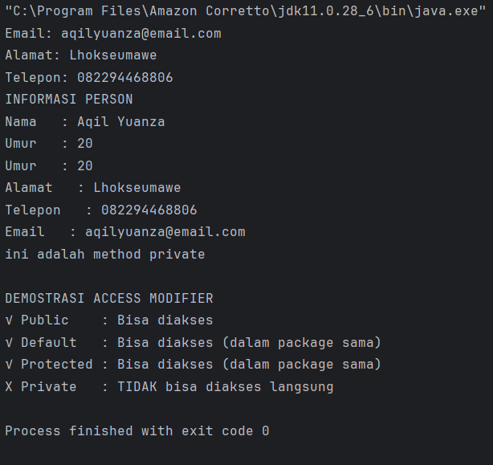
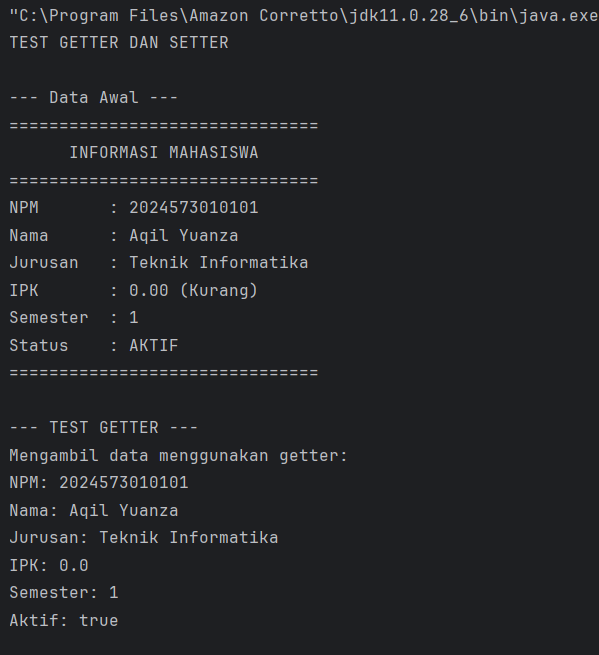

# Laporan Modul 5: Enkapsulasi
*Mata Kuliah:* Praktikum Pemrograman Berorientasi Objek   
*Nama:* [Muhammad Aqil Yuanza]  
*NIM:* [2024573010101]  
*Kelas:* [TI2A]

## 1. Abstrak
Enkapsulasi merupakan salah satu pilar utama dalam pemrograman berorientasi objek (Object-Oriented Programming/OOP) yang berfungsi untuk melindungi data dan menyembunyikan detail implementasi dari pengguna luar. Konsep ini menggabungkan data (atribut) dan metode (fungsi) yang beroperasi pada data tersebut ke dalam satu kesatuan yang disebut kelas (class). Dengan menerapkan enkapsulasi, akses langsung terhadap atribut dapat dibatasi melalui penggunaan modifier akses seperti private, protected, dan public, sehingga data hanya dapat dimanipulasi melalui metode khusus seperti getter dan setter. Tujuan utama enkapsulasi adalah meningkatkan keamanan data, menjaga konsistensi nilai variabel, serta mempermudah pemeliharaan dan pengembangan program. Dengan demikian, enkapsulasi tidak hanya mendukung prinsip modularitas dan efisiensi, tetapi juga membantu menciptakan sistem yang lebih terstruktur dan mudah dikendalikan.
#### Langkah Praktikum

-Praktikum 1: Memahami Access Modifier

1. Buat sebuah package baru di dalam package modul_5 dengan nama praktikum_1
2. Buat class baru bernama Person dengan berbagai access modifier

        package modul_5.praktikum1;
        
        public class Person {
        //private - hanya bisa diakses dalam class ini
        private String nama;
        private int umur;
    
        //default (package private)- bisa diakses dalam package yang sama
        String alamat;
    
        //protected bisa diakses dalam package subclass
        protected String telepon;
    
        //public bisa diakses dari mana saja
        public String email;
    
        //constructor
        public Person(String nama, int umur){
            this.nama = nama;
            this.umur = umur;
        }
        //public method untuk menampilkan info()
        public void tampilkanInfo() {
            System.out.println("INFORMASI PERSON");
            System.out.println("Nama    :" +nama);
            System.out.println("Umur    :" +umur);
            System.out.println("Alamat  :" +alamat);
            System.out.println("Telepon :" +telepon);
            System.out.println("Email   :" +email);
        }
    
        //private method- hanya bisa dipanggil di dalam class ini
        private void methodPribadi(){
            System.out.println("ini adalah method private");
        }
    
        //protected method
        protected void methodProtected(){
            System.out.println("ini adalah method protected");
        }
        //method untuk mengakses private method
        public void PanggilMethodPribadi() {
            methodPribadi(); //ok- dalam class yang sama
        }
        }

3. Buat class AccessModifierTest untuk testing:

        package modul_5.praktikum1;
        
        public class AccesModifierTest {
        public static void main(String[] args) {
        Person person = new Person("Aqil Yuanza", 20);
        
                //test akses public
                person.email = "aqilyuanza@gmail.com"; //ok- public
                System.out.println("email:" + person.email);
        
                //test akses default (dalam package yang sama)
                person.alamat="Lhokseumawe";
                System.out.println("alamat:" + person.alamat);
        
                //test akses protected (dalam package yang sama)
                person.telepon="082294468806";
                System.out.println("telepon:" + person.telepon);
        
                //test akses privat - AKAN ERROR jika uncomment
                //person.nama = "jack";     //ERROR- private
                //person.umur = 20;         //ERROR- private
                //person.methosPribadi();   //ERROR- private
        
                //mengakses data private melalui public method
                person.tampilkanInfo();
        
                //mengakses private method melalui public method
                person.PanggilMethodPribadi();
        
                System.out.println("\nDEMONTRASI ACCES MODIFIER");
                System.out.println("✅ public    :Bisa diakses");
                System.out.println("✅ Default   :Bisa diakses (dalam package yang sama)");
                System.out.println("✅ Protected :Bisa diakses(dalam package yang sama)");
                System.out.println("❌ Private   :TIDAK bisa diakses langsung");
            }
        }
4. Jalankan program

-Praktikum 2: Getter dan Setter

Teori Dasar

Getter dan Setter adalah method yang digunakan untuk mengakses dan mengubah nilai private attributes.

Langkah-langkah:

1. Buat sebuah package baru di dalam package modul_5 dengan nama praktikum_2
2. Buat class Mahasiswa dengan getter dan setter lengkap

        package modul_5.praktikum2;
        
        public class Mahasiswa {
        // Private attributes
        private String npm;
        private String nama;
        private String jurusan;
        private double ipk;
        private int semester;
        private boolean aktif;
        
            // Constructor
            public Mahasiswa(String npm, String nama, String jurusan) {
                this.npm = npm;
                this.nama = nama;
                this.jurusan = jurusan;
                this.ipk = 0.0;
                this.semester = 1;
                this.aktif = true;
            }
            // GETTER METHODS
            public String getNpm() {
                return npm;
            }
        
            public String getNama() {
                return nama;
            }
        
            public String getJurusan() {
                return jurusan;
            }
        
            public double getIpk() {
                return ipk;
            }
        
            public int getSemester() {
                return semester;
            }
        
            // Boolean getter menggunakan 'is' prefix
            public boolean isAktif() {
                return aktif;
            }
        
            // SETTER METHODS DENGAN VALIDASI
        
            // NPM: Read-only (tidak ada setter)
            // Alasan: NPM tidak boleh diubah setelah dibuat
            public void setNama(String nama) {
                // Validasi: Nama tidak boleh kosong
                if (nama == null || nama.trim().isEmpty()) {
                    System.out.println("✗ Nama tidak boleh kosong!");
                    return;
                }
        
                // Validasi: Nama hanya huruf dan spasi
                if (!nama.matches("[a-zA-Z ]+")) {
                    System.out.println("✗ Nama hanya boleh berisi huruf dan spasi!");
                    return;
                }
                this.nama = nama;
                System.out.println("✓ Nama berhasil diubah menjadi: " + nama);
            }
        
            public void setJurusan(String jurusan) {
                if (jurusan == null || jurusan.trim().isEmpty()) {
                    System.out.println("✗ Jurusan tidak boleh kosong!");
                    return;
                }
        
                this.jurusan = jurusan;
                System.out.println("✓ Jurusan berhasil diubah menjadi: " + jurusan);
            }
        
            public void setIpk(double ipk) {
                // Validasi: IPK antara 0.0 - 4.0
                if (ipk < 0.0 || ipk > 4.0) {
                    System.out.println("✗ IPK harus antara 0.0 - 4.0!");
                    return;
                }
                this.ipk = ipk;
                System.out.printf("✓ IPK berhasil diubah menjadi: %.2f\n", ipk);
        
                // Cek status akademik berdasarkan IPK
                cekStatusAkademik();
            }
        
            public void setSemester(int semester) {
                // Validasi: Semester antara 1 - 14
                if (semester < 1 || semester > 14) {
                    System.out.println("✗ Semester harus antara 1 - 14!");
                    return;
                }
        
                this.semester = semester;
                System.out.println("✓ Semester berhasil diubah menjadi: " + semester);
            }
            public void setAktif(boolean aktif) {
                this.aktif = aktif;
                String status = aktif ? "AKTIF" : "TIDAK AKTIF";
                System.out.println("✓ Status mahasiswa: " + status);
            }
        
            // HELPER METHODS (PRIVATE)
            private void cekStatusAkademik() {
                if (ipk < 2.0) {
                    System.out.println("⚠ Peringatan: IPK di bawah standar!");
                } else if (ipk > 3.5) {
                    System.out.println("★ Excellent! IPK sangat baik!");
                }
            }
        
            // PUBLIC METHODS
            public String getPredikat() {
                if (ipk >= 3.5) return "Cum Laude";
                else if (ipk >= 3.0) return "Sangat Baik";
                else if (ipk >= 2.5) return "Baik";
                else if (ipk >= 2.0) return "Cukup";
                else return "Kurang";
            }
            public void tampilkanInfo() {
                System.out.println("===============================");
                System.out.println("      INFORMASI MAHASISWA      ");
                System.out.println("===============================");
                System.out.println("NPM       : " + npm);
                System.out.println("Nama      : " + nama);
                System.out.println("Jurusan   : " + jurusan);
                System.out.printf("IPK       : %.2f (%s)\n", ipk, getPredikat());
                System.out.println("Semester  : " + semester);
                System.out.println("Status    : " + (aktif ? "AKTIF" : "TIDAK AKTIF"));
                System.out.println("===============================");
        }
        }

3. Buat class GetterSetterTest:

        package modul_5.praktikum2;
        
        public class GetterSetterTest {
        public static void main(String[] args) {
        System.out.println("TEST GETTER DAN SETTER\n");
        
                // Membuat object mahasiswa
                Mahasiswa mhs = new Mahasiswa("2024573010101", "Aqil Yuanza", "Teknik Informatika");
        
                System.out.println("--- Data Awal ---");
                mhs.tampilkanInfo();
        
                // Test GETTER
                System.out.println("\n--- TEST GETTER ---");
                System.out.println("Mengambil data menggunakan getter:");
                System.out.println("NPM: " + mhs.getNpm());
                System.out.println("Nama: " + mhs.getNama());
                System.out.println("Jurusan: " + mhs.getJurusan());
                System.out.println("IPK: " + mhs.getIpk());
                System.out.println("Semester: " + mhs.getSemester());
                System.out.println("Aktif: " + mhs.isAktif());
        
                // Test SETTER dengan validasi
                System.out.println("\n--- TEST SETTER ---");
        
                // Test 1: Update IPK valid
                System.out.println("\n1. Update IPK (valid):");
                mhs.setIpk(3.75);
        
                // Test 2: Update IPK invalid
                System.out.println("\n2. Update IPK (invalid):");
                mhs.setIpk(5.0); // Akan ditolak
        
                // Test 3: Update nama valid
                System.out.println("\n3. Update Nama (valid):");
                mhs.setNama("Ahmad Budi Santoso");
        
                // Test 4: Update nama invalid
                System.out.println("\n4. Update Nama (invalid - mengandung angka):");
                mhs.setNama("Budi1123"); // Akan ditolak
        // Test 5: Update semester
        System.out.println("\n5. Update Semester:");
        mhs.setSemester(5);
        
                // Test 6: Update semester invalid
                System.out.println("\n6. Update Semester (invalid):");
                mhs.setSemester(20); // Akan ditolak
        
                // Test 7: Update status
                System.out.println("\n7. Update Status:");
                mhs.setAktif(false);
        
                // Tampilkan data akhir
                System.out.println("\n--- Data Setelah Update ---");
                mhs.tampilkanInfo();
        
                // Demonstrasi computed property
                System.out.println("\n--- COMPUTED PROPERTY ---");
                System.out.println("Predikat: " + mhs.getPredikat());
        // Tidak bisa akses langsung (akan error)
        System.out.println("\nCATATAN ENCAPSULATION:");
        System.out.println("✗ TIDAK BISA: mhs.npm = \"123\";");
        System.out.println("✗ TIDAK BISA: mhs.ipk = 5.0;");
        System.out.println("✓ HARUS: mhs.setIpk(3.5);");
        System.out.println("✓ VALIDASI otomatis dilakukan di setter");
        }
        }

4. Jalankan program

-Praktikum 3: Read-Only dan Write-Only Properties

Langkah-langkah:

1. Buat sebuah package baru di dalam package modul_5 dengan nama praktikum_3
2. Buat class Product dengan berbagai jenis properties:

        package modul_5.praktikum3;
        
        import java.time.LocalDateTime;
        import java.time.format.DateTimeFormatter;
        
        public class Product {
        // Read-only (hanya getter)
        private final String productId;
        private final LocalDateTime createdAt;
        
            // Read-write (getter dan setter)
            private String nama;
            private double harga;
            private int stok;
        
            // Write-only (hanya setter) - untuk password/PIN
            private String adminPin;
        
            // Computed property (tidak ada atribut, hanya getter)
            // Total nilai = harga * stok
        
            // Counter untuk ID otomatis
            private static int counter = 1000;
            // CONSTRUCTOR
            public Product(String nama, double harga, int stok, String adminPin) {
                this.productId = generateProductId();
                this.createdAt = LocalDateTime.now();
                this.nama = nama;
                this.harga = harga;
                this.stok = stok;
                this.adminPin = adminPin;
            }
        
            // PRIVATE HELPER METHODS
            private String generateProductId() {
                counter++;
                return "PRD-" + counter;
            }
        
            private boolean validatePin(String inputPin) {
                return this.adminPin.equals(inputPin);
            }
        
            // READ-ONLY PROPERTIES (hanya getter)
            public String getProductId() {
                return productId;
            }
        
            public String getCreatedAt() {
                DateTimeFormatter formatter = DateTimeFormatter.ofPattern("dd-MM-yyyy HH:mm:ss");
                return createdAt.format(formatter);
            }
        
            // READ-WRITE PROPERTIES (getter dan setter)
            public String getNama() {
                return nama;
            }
        
            public void setNama(String nama, String pin) {
                if (!validatePin(pin)) {
                    System.out.println("✗ PIN salah! Gagal mengubah nama.");
                    return;
                }
        
                if (nama == null || nama.trim().isEmpty()) {
                    System.out.println("✗ Nama produk tidak boleh kosong!");
                    return;
                }
                this.nama = nama;
                System.out.println("✓ Nama produk berhasil diubah!");
            }
        
            public double getHarga() {
                return harga;
            }
        
            public void setHarga(double harga, String pin) {
                if (!validatePin(pin)) {
                    System.out.println("✗ PIN salah! Gagal mengubah harga.");
                    return;
                }
        
                if (harga < 0) {
                    System.out.println("✗ Harga tidak boleh negatif!");
                    return;
                }
        
                this.harga = harga;
                System.out.println("✓ Harga berhasil diubah menjadi Rp " + harga);
            }
        
            public int getStok() {
                return stok;
            }
        
            public void setStok(int stok, String pin) {
                if (!validatePin(pin)) {
                    System.out.println("✗ PIN salah! Gagal mengubah stok.");
                    return;
                }
        
                if (stok < 0) {
                    System.out.println("✗ Stok tidak boleh negatif!");
                    return;
                }
        
                this.stok = stok;
                System.out.println("✓ Stok berhasil diubah menjadi: " + stok);
            }
            // WRITE-ONLY PROPERTY (hanya setter)
            // Tidak ada getAdminPin() - untuk keamanan!
            public void changeAdminPin(String oldPin, String newPin) {
                if (!validatePin(oldPin)) {
                    System.out.println("✗ PIN lama salah!");
                    return;
                }
        
                if (newPin.length() < 4) {
                    System.out.println("✗ PIN baru minimal 4 karakter!");
                    return;
                }
        
                this.adminPin = newPin;
                System.out.println("✓ PIN berhasil diubah!");
            }
        
            // COMPUTED PROPERTIES (calculated on-the-fly)
            public double getTotalNilai() {
                return harga * stok;
            }
            public String getStatusStok() {
                if (stok == 0) return "HABIS";
                else if (stok < 10) return "MENIPIS";
                else if (stok < 50) return "TERSEDIA";
                else return "BANYAK";
            }
        
            // PUBLIC METHODS
            public boolean tambahStok(int jumlah, String pin) {
                if (!validatePin(pin)) {
                    System.out.println("✗ PIN salah!");
                    return false;
                }
        
                if (jumlah <= 0) {
                    System.out.println("✗ Jumlah harus lebih dari 0!");
                    return false;
                }
        
                stok += jumlah;
                System.out.printf("✓ Stok ditambah %d. Stok sekarang: %d\n", jumlah, stok);
                return true;
            }
            public boolean kurangiStok(int jumlah, String pin) {
                if (!validatePin(pin)) {
                    System.out.println("✗ PIN salah!");
                    return false;
                }
        
                if (jumlah <= 0) {
                    System.out.println("✗ Stok tidak cukup!");
                    return false;
                }
        
                if (jumlah > stok) {
                    System.out.printf("✗ Stok tersisa: %d, Diminta: %d\n", stok, jumlah);
                    return false;
                }
        
                stok -= jumlah;
                System.out.printf("✓ Stok dikurangi %d. Stok sekarang: %d\n", jumlah, stok);
        
                // Warning stok menipis
                if (stok < 10)
                    System.out.println("⚠ Peringatan: Stok menipis!");
        
                return true;
            }
        
            public void tampilkanInfo() {
                System.out.println("======== INFORMASI PRODUK ========");
                System.out.println("Product ID  : " + productId);
                System.out.println("Nama        : " + nama);
                System.out.println("Harga       : Rp " + harga);
                System.out.println("Stok        : " + stok + " (" + getStatusStok() + ")");
                System.out.println("Total Nilai : Rp " + getTotalNilai());
                System.out.println("Dibuat pada : " + getCreatedAt());
                System.out.println("==================================");
        }
        }

3. Buat class ProductTest untuk testing:

        package modul_5.praktikum3;
        
        import java.util.Scanner;
        
        public class ProductTest {
        public static void main(String[] args) {
        Scanner input = new Scanner(System.in);
        
                System.out.println("SISTEM MANAJEMEN PRODUK");
        
                // Membuat produk dengan PIN
                Product laptop = new Product("Laptop ASUS", 8500000, 15, "1234");
                Product mouse = new Product("Mouse Logitech", 150000, 50, "1234");
        
                System.out.println("PRODUK BERHASIL DIBUAT");
                laptop.tampilkanInfo();
                mouse.tampilkanInfo();
        
                // TEST READ-ONLY PROPERTIES
                System.out.println("TEST READ-ONLY PROPERTIES");
                System.out.println("Product ID (read-only): " + laptop.getProductId());
                System.out.println("Created At (read-only): " + laptop.getCreatedAt());
                System.out.println("✓ Properti ini TIDAK BISA diubah setelah dibuat");
        // TEST READ-WRITE PROPERTIES
        System.out.println("TEST READ-WRITE PROPERTIES");
        
                // Test 1: Ubah harga tanpa PIN (akan gagal)
                System.out.println("\n1. Mencoba ubah harga dengan PIN salah:");
                laptop.setHarga(9000000, "0000");
        
                // Test 2: Ubah harga dengan PIN benar
                System.out.println("\n2. Ubah harga dengan PIN benar:");
                laptop.setHarga(9000000, "1234");
        
                // Test 3: Ubah nama
                System.out.println("\n3. Ubah nama produk:");
                laptop.setNama("Laptop ASUS ROG", "1234");
        
                // Test 4: Ubah stok
                System.out.println("\n4. Ubah stok:");
                laptop.setStok(20, "1234");
        
                // TEST WRITE-ONLY PROPERTY
                System.out.println("TEST WRITE-ONLY PROPERTY (PIN)");
                System.out.println("PIN tidak bisa dibaca (tidak ada getter)");
                System.out.println("Hanya bisa diubah dengan validasi PIN lama:");
                laptop.changeAdminPin("1234", "5678");
                laptop.changeAdminPin("0000", "9999"); // Akan gagal
        
                // TEST COMPUTED PROPERTIES
                System.out.println("TEST COMPUTED PROPERTIES");
                System.out.printf("Total Nilai Laptop : Rp %.2f\n", laptop.getTotalNilai());
                System.out.println("Status Stok Laptop : " + laptop.getStatusStok());
                System.out.printf("Total Nilai Mouse  : Rp %.2f\n", mouse.getTotalNilai());
                System.out.println("Status Stok Mouse  : " + mouse.getStatusStok());
        
                // TEST BUSINESS METHODS
                System.out.println("TEST BUSINESS METHODS");
        
                System.out.println("\n1. Tambah stok laptop:");
                laptop.tambahStok(10, "5678"); // PIN sudah diubah
        
                System.out.println("\n2. Kurangi stok mouse (penjualan):");
                mouse.kurangiStok(45,"5678");
        
                System.out.println("\n3. Kurangi stok mouse lagi (stok akan menipis):");
                mouse.kurangiStok(4, "5678");
                System.out.println("\n4. Coba kurangi stok lebih dari tersedia:");
                mouse.kurangiStok(10, "5678");
        
                // TAMPILKAN INFO AKHIR
                System.out.println("INFORMASI PRODUK SETELAH UPDATE");
                laptop.tampilkanInfo();
                mouse.tampilkanInfo();
        
                // RINGKASAN ENCAPSULATION
                System.out.println("RINGKASAN ENCAPSULATION");
                System.out.println("-----------------------------------");
                System.out.println("READ-ONLY   : productId, createdAt ");
                System.out.println("              (tidak bisa diubah) ");
                System.out.println();
                System.out.println("READ-WRITE  : nama, harga, stok ");
                System.out.println("              (dengan validasi) ");
                System.out.println();
                System.out.println("WRITE-ONLY  : adminPin ");
                System.out.println("              (tidak bisa dibaca) ");
                System.out.println();
                System.out.println("COMPUTED    : totalNilai, statusStok ");
                System.out.println("              (dihitung otomatis) ");
        }
        }

4. Jalankan program

#### Screenshoot Hasil

#### Analisa dan Pembahasan

1. CLASS Person

Deklarasi Kelas

    public class Person {

Deklarasi Atribut (Field)

    private String nama;
    private int umur;
    String alamat;
    protected String telepon;
    public String email;

Constructor

    public Person(String nama, int umur){
    this.nama = nama;
    this.umur = umur;
    }

Constructor digunakan untuk menginisialisasi objek Person dengan dua parameter (nama dan umur).
this.nama menunjukkan variabel instance, bukan variabel parameter.

Method Publik: tampilkanInfo()

        public void tampilkanInfo(){
        System.out.println("INFORMASI PERSON");
        ...
        }

Method ini menampilkan semua data pribadi (nama, umur, alamat, telepon, email).
Karena bersifat public, bisa diakses dari luar kelas, misalnya:

    Person p = new Person("Budi", 20);
    p.tampilkanInfo();

Method Private: methodPribadi()

    private void methodPribadi(){
    System.out.println("ini adalah method private");
    }

Method ini hanya bisa dipanggil di dalam kelas Person.
Tidak bisa diakses dari luar, bahkan oleh subclass.

Method Protected: methodProtected()

    protected void methodProtected(){
    System.out.println("ini adalah method protected");
    }

Method ini bisa diakses oleh subclass atau kelas lain dalam package yang sama.

Method untuk Memanggil Private Method

        public void PanggilMethodPribadi(){
        methodPribadi(); // ok, karena masih dalam kelas yang sama
        }

Method ini digunakan untuk mengakses method private secara tidak langsung.
Ini adalah teknik encapsulation — menjaga agar detail internal tetap tersembunyi.

2. Praktikum 1

-Isi Kelas

    public class AccessModifierTest {
    public static void main(String[] args) {
    Person person = new Person("Aqil Yuanza", 20);
    ...
    }
    }

Kelas ini berfungsi untuk menguji aksesibilitas (access modifier) dari atribut dan method dalam kelas Person.

-Membuat Objek

    Person person = new Person("Aqil Yuanza", 20);

-Memanggil konstruktor Person dengan parameter nama dan umur.

-Akses public

    person.email = "aqilyuanza@gmail.com"; // ok - public
    System.out.println("email: " + person.email);

✅Berhasil, karena email bersifat public — bisa diakses dari mana saja.

-Akses default (package-private)

    person.alamat = "Lhokseumawe";
    System.out.println("alamat: " + person.alamat);

✅Berhasil, karena AccessModifierTest dan Person ada di package yang sama (modul_5.praktikum1).

-Akses protected

    person.telepon = "082294468806";
    System.out.println("telepon: " + person.telepon);

✅Berhasil, karena masih di package yang sama (meskipun bukan subclass).

-Akses private (akan error)

    //person.nama = "jack";   // ERROR
    //person.umur = 20;       // ERROR
    //person.methodPribadi(); // ERROR

❌ Tidak bisa diakses, karena nama, umur, dan methodPribadi() dideklarasikan sebagai private di kelas Person.

-Akses data private melalui public method

    person.tampilkanInfo();

✅ Berhasil — meskipun nama dan umur private, mereka bisa ditampilkan lewat method publik tampilkanInfo() yang sudah didefinisikan di Person.

-Akses method private melalui public method

    person.PanggilMethodPribadi();

✅ Berhasil — method PanggilMethodPribadi() bersifat public dan memanggil methodPribadi() yang private secara internal.
Ini contoh encapsulation (enkapsulasi) yang benar.

Output Penjelasan Akses

    System.out.println("\nDEMONSTRASI ACCESS MODIFIER");
    System.out.println("✅ public : Bisa diakses");
    System.out.println("✅ Default : Bisa diakses (dalam package yang sama)");
    System.out.println("✅ Protected : Bisa diakses (dalam package yang sama)");
    System.out.println("❌ Private : Tidak bisa diakses langsung");

Menampilkan hasil akhir dari percobaan, memberi ringkasan aksesibilitas masing-masing modifier.

3. Praktikum 2

-Atribut Private

    private String npm;
    private String nama;
    private String jurusan;
    private double ipk;
    private int semester;
    private boolean aktif;

-Constructor

        public Mahasiswa(String npm, String nama, String jurusan) {
        this.npm = npm;
        this.nama = nama;
        this.jurusan = jurusan;
        this.ipk = 0.0;
        this.semester = 1;
        this.aktif = true;
        }

-Inisialisasi objek mahasiswa baru.

Secara default:

-ipk = 0.0

-semester = 1

-aktif = true

-Getter Methods

Getter digunakan untuk mengambil nilai atribut private.

    public String getNpm() { return npm; }
    public String getNama() { return nama; }
    public String getJurusan() { return jurusan; }
    public double getIpk() { return ipk; }
    public int getSemester() { return semester; }
    public boolean isAktif() { return aktif; }

-Catatan:

isAktif() menggunakan awalan is karena tipenya boolean.

Setter Methods dengan Validasi

a. setNama(String nama)

-Tidak boleh kosong.

-Hanya boleh berisi huruf dan spasi.

    if (nama == null || nama.trim().isEmpty()) ...
    if (!nama.matches("[a-zA-Z ]+")) ...
Jika valid → nama diperbarui, dan muncul pesan:

    ✓ Nama berhasil diubah menjadi: <nama>

b. setJurusan(String jurusan)

Tidak boleh kosong.
Jika valid → menampilkan:

    ✓ Jurusan berhasil diubah menjadi: <jurusan>

c. setIpk(double ipk)

Rentang valid: 0.0 – 4.0
Jika valid → mengubah nilai dan menampilkan:

    ✓ IPK berhasil diubah menjadi: <ipk>

Lalu otomatis memanggil:

    cekStatusAkademik();

untuk mengecek apakah IPK di bawah standar.

d. setSemester(int semester)

Valid antara 1 – 14
Jika di luar rentang → tampilkan pesan kesalahan.

e. setAktif(boolean aktif)

Mengubah status aktif dan menampilkan status baru:

    ✓ Status mahasiswa: AKTIF

atau

    ✓ Status mahasiswa: TIDAK AKTIF

Helper Method (Private)

    private void cekStatusAkademik() {
    if (ipk < 2.0)
    System.out.println("⚠ Peringatan: IPK di bawah standar!");
    else if (ipk > 3.5)
    System.out.println("★ Excellent! IPK sangat baik!");
    }

Menentukan predikat kelulusan berdasarkan IPK.

Public Method tampilkanInfo()

Menampilkan seluruh data mahasiswa dalam format tabel rapi:

    System.out.println("==============================");
    System.out.println("      INFORMASI MAHASISWA     ");
    System.out.println("==============================");
    System.out.println("NPM      : " + npm);
    System.out.println("Nama     : " + nama);
    System.out.println("Jurusan  : " + jurusan);
    System.out.printf("IPK      : %.2f (%s)\n", ipk, getPredikat());
    System.out.println("Semester : " + semester);
    System.out.println("Status   : " + (aktif ? "AKTIF" : "TIDAK AKTIF"));
    System.out.println("==============================");

Jika valid → nama diperbarui, dan muncul pesan:

4. praktikum 3

1. class produk

1. Struktur Umum Kelas

        public class Product {
        // Atribut utama
        private final String productId;
        private final LocalDateTime createdAt;
        private String nama;
        private double harga;
        private int stok;
        private String adminPin;
        
            private static int counter = 1000;
        }

-productId dan createdAt → Read-only, karena diberi final.

-nama, harga, stok → Read-write, artinya bisa diubah dan dibaca.

-adminPin → Write-only, artinya hanya bisa diset, tidak bisa dibaca.

-counter → Static, untuk memberi nomor ID unik otomatis pada setiap produk.

2. Constructor

        public Product(String nama, double harga, int stok, String adminPin) {
        this.productId = generateProductId();
        this.createdAt = LocalDateTime.now();
        this.nama = nama;
        this.harga = harga;
        this.stok = stok;
        this.adminPin = adminPin;
        }

Setiap kali objek baru dibuat:

-ID otomatis dibuat seperti PRD-1001, PRD-1002, dst.

-createdAt otomatis diisi waktu saat pembuatan objek.

-PIN diset untuk keamanan.

3. Helper Methods

a. generateProductId()

Meningkatkan counter dan memberi ID unik:

        private String generateProductId() {
        counter++;
        return "PRD-" + counter;
        }

b. validatePin()

Validasi PIN saat akan mengubah data:

    private boolean validatePin(String inputPin) {
    return this.adminPin.equals(inputPin);
    }

-Jika PIN salah → operasi dibatalkan.

4. Properti Read-only

Getter untuk data yang tidak bisa diubah:

    public String getProductId() { return productId; }
    
    public String getCreatedAt() {
    DateTimeFormatter formatter = DateTimeFormatter.ofPattern("dd-MM-yyyy HH:mm:ss");
    return createdAt.format(formatter);
    }

5. Properti Read-write

Getter dan setter untuk nama, harga, dan stok.

a. Setter setNama()

-Harus pakai PIN.

-Nama tidak boleh kosong.

-Jika valid → nama diubah.

b. Setter setHarga()

-Harus pakai PIN.

-Harga tidak boleh negatif.

c. Setter setStok()

-Harus pakai PIN.

-Stok tidak boleh negatif.

Contoh pola validasi:

    if (!validatePin(pin)) {
    System.out.println("X PIN salah!");
    return;
    }
    if (stok < 0) {
    System.out.println("X Stok tidak boleh negatif!");
    return;
    }
    this.stok = stok;

6. Properti Write-only

Metode untuk mengganti PIN:

        public void changeAdminPin(String oldPin, String newPin) {
        if (!validatePin(oldPin)) {
        System.out.println("X PIN lama salah!");
        return;
        }
        if (newPin.length() < 4) {
        System.out.println("X PIN baru minimal 4 karakter!");
        return;
        }
        this.adminPin = newPin;
        System.out.println("✓ PIN berhasil diubah");
        }

-Tidak ada getAdminPin() untuk keamanan.

7. Computed Properties

Dihitung langsung saat dipanggil (tidak disimpan di atribut).

a. Total nilai

    public double getTotalNilai() {
    return harga * stok;
    }

b. Status stok

    public String getStatusStok() {
    if (stok == 0) return "HABIS";
    else if (stok < 10) return "MENIPIS";
    return "AMAN";
    }

8. Method tambahStok(int jumlah, String pin)

        if (!validatePin(pin)) {
        System.out.println("✗ PIN salah!");
        return false;
        }
- Mengecek apakah PIN benar (dengan method validatePin(), tidak ditampilkan di sini).

- salah → cetak pesan dan keluar (return false).

        if (jumlah <= 0) {
        System.out.println("✗ Jumlah harus lebih dari 0!");
        return false;
        }
- Validasi agar tidak bisa menambah stok dengan angka nol atau negatif.

        stok += jumlah;
        System.out.printf("✓ Stok ditambah %d. Stok sekarang: %d\n", jumlah, stok);
        return true;
- Jika valid, stok ditambah dan menampilkan hasil.

- Mengembalikan true sebagai tanda berhasil.

9. Method kurangiStok(int jumlah)

Fungsi:

Mengurangi stok dengan validasi agar tidak minus dan memberikan peringatan stok menipis.

    if (jumlah <= 0) {
    System.out.println("✗ Jumlah harus lebih dari 0!");
    return false;
    }

- Cegah input negatif atau nol.

        if (jumlah > stok) {
        System.out.println("✗ Stok tidak cukup!");
        System.out.printf("  Stok tersedia: %d, Diminta: %d\n", stok, jumlah);
        return false;
        }
- Jika jumlah yang ingin dikurangi lebih besar dari stok → tolak dan tampilkan info stok saat ini.

        stok -= jumlah;
        System.out.printf("✓ Stok dikurangi %d. Stok sekarang: %d\n", jumlah, stok);
- Kurangi stok dan tampilkan hasil.

        if (stok < 10) {
        System.out.println
10. Method tampilkanInfo()

Fungsi:

Menampilkan seluruh informasi produk di konsol secara terformat.

    public void tampilkanInfo() {
    System.out.println("INFORMASI PRODUK");
    System.out.println("------------------------------");
    System.out.println(" Product ID   : " + productId);
    System.out.println(" Nama         : " + nama);
    System.out.printf(" Harga        : Rp %.2f\n", harga);
    System.out.println(" Stok         : " + stok + " (" + getStatusStok() + ")");
    System.out.printf(" Total Nilai  : Rp %.2f\n", getTotalNilai());
    System.out.println(" Dibuat pada  : " + getCreatedAt());
    System.out.println("------------------------------");
    }

- Menampilkan informasi utama:

    - productId, nama, harga, stok, dan status stok.

    - getStatusStok() → menampilkan status stok seperti “KOSONG”, “TERSEDIA”, “BANYAK”.

    - getTotalNilai() → mungkin stok * harga.

    - getCreatedAt() → tanggal produk dibuat.

- Menggunakan format yang rapi dan mudah dibaca.

2. CLASS PRODUKTEST

1. Gambaran Umum

Nama kelas:

    public class ProductTest {
    public static void main(String[] args) {
    ...
    }
    }

Kode ini berfungsi sebagai program utama (tester) untuk menguji seluruh fitur dari kelas Product yang sudah kamu tunjukkan sebelumnya (dengan method seperti tambahStok, kurangiStok, tampilkanInfo, dll).

2. Bagian-bagian Kode

🔹Import

         import java.util.Scanner;
- Dipakai untuk membaca input dari user di console (meskipun di kode ini Scanner belum digunakan secara aktif).

🔹 Inisialisasi Produk

    Product laptop = new Product("Laptop ASUS", 8000000, 15, "1234");
    Product mouse = new Product("Mouse Logitech", 150000, 60, "4321");

- nMembuat dua objek:

    -  laptop dengan harga Rp 8.000.000, stok awal 15, PIN “1234”.

    - mouse dengan harga Rp 150.000, stok awal 60, PIN “4321”.

Menunjukkan konsep instansiasi dan enkapsulasi objek (setiap produk punya data sendiri).

🔹 Informasi Awal Produk

    System.out.println("TEST READ-ONLY PROPERTIES:");
    System.out.println("Product ID : " + laptop.getProductId());
    System.out.println("Nama       : " + laptop.getNama());
    System.out.println("Harga      : " + laptop.getHarga());
    System.out.println("Stok awal  : " + laptop.getStok());

- Uji dua skenario:

    - PIN salah → output: "✗ PIN salah!"

    - PIN benar → stok bertambah +5 dan tampilkan stok baru.

Menguji validasi keamanan validatePin().

🔹 Test Pengurangan Stok

    laptop.kurangiStok(3);
    laptop.kurangiStok(20);

- Mengurangi stok 3 (valid).

- Mengurangi 20 (stok tidak cukup) → memicu pesan “✗ Stok tidak cukup!”.

Menguji validasi stok minimum & pesan peringatan stok menipis.

🔹 Test Metode Hitungan

    System.out.println("Total Nilai Laptop = " + laptop.getTotalNilai());
    System.out.println("Status Stok Laptop = " + laptop.getStatusStok());

- getTotalNilai() = harga × stok.

- getStatusStok() → “KOSONG”, “TERSEDIA”, atau “BANYAK”.

Menguji metode perhitungan & status stok secara dinamis.

🔹 Test tampilkanInfo()

    laptop.tampilkanInfo();

Menampilkan seluruh detail produk secara format tabel (seperti di kode sebelumnya).
Membuktikan integrasi semua getter dan perhitungan.

🔹 Test kurangiStok() Lagi

        laptop.kurangiStok(20);
        laptop.kurangiStok(-5);

- Kasus stok tidak cukup (stok < jumlah).

- Kasus jumlah negatif (invalid input).

Menunjukkan robust error handling (tidak ada crash, hanya pesan error).

🔹 Test Setelah Update

        System.out.println("INFORMASI PRODUK SETELAH UPDATE:");
        laptop.tampilkanInfo();

Menampilkan data setelah semua transaksi stok dilakukan.

🔹 Bagian Akhir (Output Format)

    System.out.println("============================");
    System.out.println("✓ Sukses");
    System.out.println("✓ Tidak ada error runtime");
    System.out.println("============================");

- Menandakan semua test berjalan tanpa error.
  Bagus untuk debugging — semacam "test summary".

## 3. Kesimpulan
Dengan diterapkannya prinsip enkapsulasi, program dapat menjaga integritas, konsistensi, dan keamanan data dengan membatasi akses langsung terhadap atribut-atribut penting di dalam kelas. Setiap interaksi terhadap data dilakukan melalui metode publik yang telah disediakan, seperti getter dan setter, sehingga proses pembacaan maupun perubahan data dapat dikontrol secara terstruktur dan aman. Penerapan prinsip ini juga memungkinkan adanya validasi dan logika tambahan sebelum data dimodifikasi, sehingga mencegah terjadinya kesalahan atau manipulasi yang tidak diinginkan. Selain itu, enkapsulasi berperan penting dalam mendukung konsep data hiding, meningkatkan modularitas, serta memperkuat arsitektur perangkat lunak agar lebih mudah dikelola, diuji, dan dikembangkan di masa mendatang. Dengan demikian, penerapan enkapsulasi tidak hanya meningkatkan keamanan data, tetapi juga berkontribusi terhadap terciptanya sistem yang efisien, terorganisasi, dan berorientasi pada kualitas dalam pengembangan perangkat lunak berbasis objek.

## 4. Referensi
https://hackmd.io/@mohdrzu/B1-q0qERel#Praktikum-3-Read-Only-dan-Write-Only-Properties