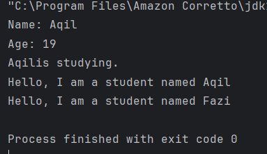
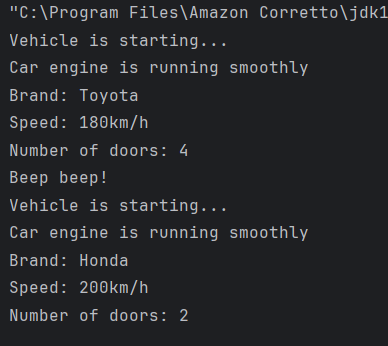
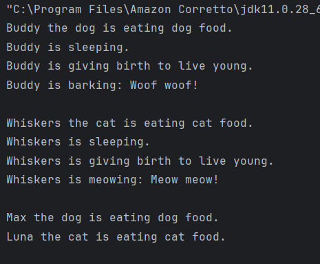
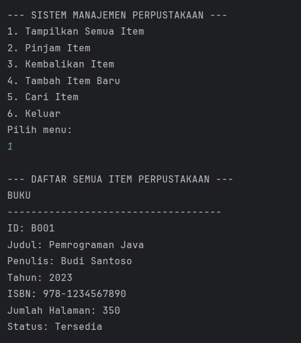

# Laporan Modul 6: Inheritance
*Mata Kuliah:* Praktikum Pemrograman Berorientasi Objek   
*Nama:* [Muhammad Aqil Yuanza]  
*NIM:* [2024573010101]  
*Kelas:* [TI2A]

## 1. Abstrak
Inheritance (pewarisan) merupakan salah satu pilar utama dalam Object-Oriented Programming (OOP) yang memungkinkan sebuah kelas baru mewarisi atribut dan metode dari kelas lain. Konsep ini dirancang untuk meningkatkan reuse kode, mempermudah pemeliharaan, serta menciptakan struktur program yang lebih modular dan terorganisir. Melalui inheritance, relasi hierarkis antara kelas induk (parent/superclass) dan kelas turunan (child/subclass) dapat dibangun, sehingga subclass dapat memperluas atau memodifikasi perilaku yang diwariskan. Penerapan inheritance mendukung prinsip OOP lainnya seperti polymorphism dan enkapsulasi, serta mendorong desain perangkat lunak yang lebih fleksibel dan efisien.
#### Langkah Praktikum

-Praktikum 1: Memahami Single Inheritance

1. Buat sebuah package baru di dalam package modul_6 dengan nama praktikum_1
2. Buat class Person sebagai superclass:

         package modul_6.praktikum_1;

         public class Person {
         protected String name;
         protected int age;

       public Person(String name, int age) {
          this.name = name;
        this.age = age;
       }

          public void displayInfo() {
          System.out.println("Name: " + name);
        System.out.println("Age: " + age);
       }

         public void greet() {
          System.out.println("Hello, I am a person.");
       }
       }
3. Buat class Student sebagai subclass yang mewarisi Person:

       package modul_6.praktikum_1;

       public class Student extends Person {
       private String studentId;

       public Student(String name, int age, String studentId) {
        super(name, age); //memanggil constructor superclass
        this.studentId = studentId;
       }

       public void study() {
        System.out.println(name + "is studying.");
       }

       @Override
       public void greet() {
        System.out.println("Hello, I am a student named " + name);
       }

       }
4. Buat class InheritanceTest untuk testing:

       package modul_6.praktikum_1;

       public class InheritanceTest {
       public static void main(String[] args) {
       Student student = new Student("Aqil", 19, "2024573010101");

        //memanggil method dari superclass
        student.displayInfo();

        //memanggil method dari subclass
        student.study();

        //memanggil overridden method
        student.greet();

        //polymorphism: student sebagai person
        Person person = new Student("Fazi", 19, "2024573010068");
        person.greet(); // memanggil method yang di-override

       }
       }
5. Jalankan program dan amati hasilnya
6. Perhatikan bagaimana subclass mewarisi dan memperluas fungsionalitas superclass

-Praktikum 2: Method Overriding dan Kata Kunci super

1. Buat sebuah package baru di dalam package modul_6 dengan nama praktikum_2
2. Buat class Vehicle sebagai superclass:

         package modul_6.praktikum_2;
         public class Vehicle {
         protected String brand;
         protected int speed;

         public Vehicle(String brand, int speed) {
         this.brand = brand;
         this.speed = speed;
       }

         public void start() {
         System.out.println("Vehicle is starting...");
       }

         public void displayInfo() {
         System.out.println("Brand: " + brand);
         System.out.println("Speed: " + speed + "km/h");
       }
       }
3. Buat class Car sebagai subclass yang mewarisi Vehicle:

         package modul_6.praktikum_2;

         public class Car extends Vehicle {
         private int numberofDoors;
    
         public Car(String brand, int speed, int numberofDoors) {
             super(brand, speed); //memanggil constructor superclass
             this.numberofDoors = numberofDoors;
         }
        
         @Override
         public void start() {
             super.start(); // memanggil method start dari superclass
             System.out.println("Car engine is running smoothly");
         }
        
         @Override
         public void displayInfo() {
             super.displayInfo(); //memanggil method displayinfo dari superclass
             System.out.println("Number of doors: " + numberofDoors);
         }
        
         public void honk() {
             System.out.println("Beep beep!");
         }
         }
4. Buat class OverrideTest untuk testing:

        package modul_6.praktikum_2;
        
        public class OverrideTest {
        public static void main(String[] args) {
        Car car = new Car("Toyota", 180, 4);

        //memanggil overriden method
        car.start();
        car.displayInfo();
        car.honk();

        //demonstrasi polymorphism
        Vehicle vehicle = new Car("Honda", 200, 2);
        vehicle.start(); //memanggil method yang di override
        vehicle.displayInfo(); //memanggil method yang di override
       }
       }
5. Jalankan program dan amati:

-Praktikum 3: Multilevel dan Hierarchical Inheritance

1. Buat sebuah package baru di dalam package modul_6 dengan nama praktikum_3
2. Buat class Animal sebagai superclass:

        package modul_6.praktikum_3;
        
        public class Animal {
        protected String name;

        public Animal(String name) {
            this.name = name;
        }
    
        public void eat() {
            System.out.println(name + " is eating.");
        }
    
        public void sleep() {
            System.out.println(name + " is sleeping.");
        }
        }
3. Buat class Mammal yang mewarisi Animal (multilevel inheritance):

        package modul_6.praktikum_3;
        
        public class Mammal extends Animal{
        protected String furColor;

        public Mammal(String name, String furColor) {
            super(name);
            this.furColor = furColor;
        }
    
        public void giveBirth() {
            System.out.println(name + " is giving birth to live young.");
        }
        }
4. Buat class Dog yang mewarisi Mammal (multilevel inheritance):

        package modul_6.praktikum_3;
        
        public class Dog extends Mammal {
        private String breed;

        public Dog(String name, String furColor, String breed ) {
            super(name, furColor);
            this.breed = breed;
        }
    
        public void bark() {
            System.out.println(name + " is barking: Woof woof!");
        }
    
        @Override
        public void eat() {
            System.out.println(name + " the dog is eating dog food.");
        }
        }
5. Buat class Cat yang mewarisi Mammal (hierarchical inheritance):

        package modul_6.praktikum_3;
        
        public class Cat extends Mammal {
        private boolean isIndoor;

        public Cat(String name, String furColor, boolean isIndoor) {
            super(name, furColor);
            this.isIndoor = isIndoor;
        }
    
        public void meow() {
            System.out.println(name + " is meowing: Meow meow!");
        }
    
        @Override
        public void eat() {
            System.out.println(name + " the cat is eating cat food.");
        }
        }
6. Buat class InheritanceTypeTest untuk testing:

        package modul_6.praktikum_3;
        
        public class InheritanceTypeTest {
        public static void main(String[] args) {
        //multilevel inheritence test
        Dog dog = new Dog("Buddy", "Brown", "Golden Retriever");
        dog.eat(); //dari animal di override di dog
        dog.sleep(); //dari animal
        dog.giveBirth(); //dari mammal
        dog.bark(); //dari dog

        System.out.println();

        //hierarchical inheritance test
        Cat cat = new Cat("Whiskers", "White", true);
        cat.eat(); //dari animal di override di cat
        cat.sleep(); //dari animal
        cat.giveBirth(); //dari mammal
        cat.meow(); //dari cat

        System.out.println();

        //polymorphism dengan hierarrchical inheritance
        Animal[] animals = {new Dog("Max", "Black", "Labrador"),
                            new Cat("Luna", "Gray", false)};

        for (Animal animal : animals) {
            animal.eat(); //akan memanggil method yang sesuai dengan objek sebenarnya
        }
        }
        }
7. Jalankan program dan amati:

-Praktikum 4: Sistem Manajemen Perpustakaan Sederhana

1. Buat sebuah package baru di dalam package modul_6 dengan nama praktikum_4
2. Buat class LibraryItem sebagai superclass:

        package modul_6.praktikum_4;
        
        public abstract class LibraryItem {
        protected String itemId;
        protected String title;
        protected int year;
        protected boolean isAvailable;

        public LibraryItem(String itemId, String title, int year) {
            this.itemId = itemId;
            this.title = title;
            this.year = year;
            this.isAvailable = true;
        }
    
        // Getter methods
        public String getItemId() { return itemId; }
        public String getTitle() { return title; }
        public int getYear() { return year; }
        public boolean isAvailable() { return isAvailable; }
    
        // Setter methods
        public void setAvailable(boolean available) { isAvailable = available; }
    
        // Abstract method yang harus diimplementasikan subclass
        public abstract void displayInfo();
    
        // Concrete method yang bisa digunakan semua subclass
        public void borrowItem() {
            if (isAvailable) {
                isAvailable = false;
                System.out.println(title + " berhasil dipinjam");
            } else {
                System.out.println(title + " sedang tidak tersedia");
            }
        }
    
        public void returnItem() {
            isAvailable = true;
            System.out.println(title + " berhasil dikembalikan");
        }
        }
3. Buat class Book yang mewarisi LibraryItem:

        package modul_6.praktikum_4;
        
        public class Book extends LibraryItem {
        private String author;
        private String isbn;
        private int numberOfPages;

        public Book(String itemID, String title, int year, String author, String isbn, int numberOfPages) {
            super(itemID, title, year);
            this.author = author;
            this.isbn = isbn;
            this.numberOfPages = numberOfPages;
        }
    
        @Override
        public void displayInfo() {
            System.out.println("BUKU");
            System.out.println("------------------------------------");
            System.out.println("ID: " + itemId);
            System.out.println("Judul: " + title);
            System.out.println("Penulis: " + author);
            System.out.println("Tahun: " + year);
            System.out.println("ISBN: " + isbn);
            System.out.println("Jumlah Halaman: " + numberOfPages);
            System.out.println("Status: " + (isAvailable ? "Tersedia" : "Dipinjam"));
            System.out.println("------------------------------------");
        }
    
        // Method khusus Book
        public void readSample() {
            System.out.println("Membaca sample dari buku: " +title);
        }
        }
4. Buat class Magazine yang mewarisi LibraryItem:

        package modul_6.praktikum_4;
        
        public class Magazine extends LibraryItem {
        private String publisher;
        private int issueNumber;
        private String category;

        public Magazine(String itemID, String title, int year, String publisher, int issueNumber, String category) {
            super(itemID, title, year);
            this.publisher = publisher;
            this.issueNumber = issueNumber;
            this.category = category;
        }
    
        @Override
        public void displayInfo() {
            System.out.println("---------- MAJALAH ----------");
            System.out.println("ID: " + itemId);
            System.out.println("Judul: " + title);
            System.out.println("Penerbit: " + publisher);
            System.out.println("Tahun: " + year);
            System.out.println("Edisi: " + issueNumber);
            System.out.println("Kategori: " + category);
            System.out.println("Status: " + (isAvailable ? "Tersedia" : "Dipinjam"));
            System.out.println("-----------------------------");
        }
    
        // Method khusus Magazine
        public void browseArticles() {
            System.out.println("Menelusuri artikel dalam majalah: " +title);
        }
        }
5. Buat class DVD yang mewarisi LibraryItem:

        package modul_6.praktikum_4;
        
        public class DVD extends LibraryItem {
        private String director;
        private int duration; // dalam menit
        private String genre;

        public DVD(String itemId, String title, int year, String director, int duration, String genre) {
            super(itemId, title, year);
            this.director = director;
            this.duration = duration;
            this.genre = genre;
        }
    
        @Override
        public void displayInfo() {
            System.out.println("---------- DVD ----------");
            System.out.println("ID: " + itemId);
            System.out.println("Judul: " + title);
            System.out.println("Sutradara: " + director);
            System.out.println("Tahun: " + year);
            System.out.println("Durasi: " + duration + " menit");
            System.out.println("Genre: " + genre);
            System.out.println("Status: " + (isAvailable ? "Tersedia" : "Dipinjam"));
            System.out.println("-------------------------");
        }
    
        // Method khusus DVD
        public void playTrailer() {
            System.out.println("Memutar trailer DVD: " + title);
        }
        }
6. Buat class LibraryManagementSystem sebagai main class:

        package modul_6.praktikum_4;
        
        import java.util.ArrayList;
        import java.util.Scanner;
        
        public class LibraryManagementSystem {
        private static ArrayList<LibraryItem> libraryItems = new ArrayList<>();
        private static Scanner scanner = new Scanner(System.in);

        public static void main(String[] args) {
            initializeSampleData();
    
            while (true) {
                displayMenu();
                int choice = scanner.nextInt();
                scanner.nextLine(); // consume newline
    
                switch (choice) {
                    case 1:
                        displayAllItems();
                        break;
                    case 2:
                        addItem();
                        break;
                    case 3:
                        borrowItem();
                        break;
                    case 4:
                        returnItem();
                        break;
                    case 5:
                        searchItem();
                        break;
                    case 6:
                        System.out.println("Terima kasih telah menggunakan sistem perpustakaan!");
                        return;
                    default:
                        System.out.println("Pilihan menu tidak valid!");
                }
            }
        }
    
        private static void displayMenu() {
            System.out.println("\n--- SISTEM MANAJEMEN PERPUSTAKAAN ---");
            System.out.println("1. Tampilkan Semua Item");
            System.out.println("2. Pinjam Item");
            System.out.println("3. Kembalikan Item");
            System.out.println("4. Tambah Item Baru");
            System.out.println("5. Cari Item");
            System.out.println("6. Keluar");
            System.out.println("Pilih menu: ");
        }
 
        private static void initializeSampleData() {
            libraryItems.add(new Book("B001", "Pemrograman Java", 2023, "Budi Santoso", "978-1234567890", 350));
            libraryItems.add(new Book("B002", "Struktur Data", 2022, "Hari Bask", "978-0987654321", 280));
            libraryItems.add(new Magazine("M001", "National Geographic", 2023, "PT Majalah", 244, "Sains"));
            libraryItems.add(new DVD("D001", "The Java Documentary", 2023, "John Programmer", 120, "Edukasi"));
        }
    
        private static void displayAllItems() {
            System.out.println("\n--- DAFTAR SEMUA ITEM PERPUSTAKAAN ---");
            for (LibraryItem item : libraryItems) {
                item.displayInfo();
            }
        }
    
        private static void borrowItem() {
            System.out.print("Masukkan ID item yang ingin dipinjam: ");
            String itemId = scanner.nextLine();
    
            for (LibraryItem item : libraryItems) {
                if (item.getItemId().equalsIgnoreCase(itemId)) {
                    item.borrowItem();
                    return;
                }
            }
    
            System.out.println("Item dengan ID " + itemId + " tidak ditemukan!");
        }
    
        private static void returnItem() {
            System.out.print("Masukkan ID item yang ingin dikembalikan: ");
            String itemId = scanner.nextLine();
    
            for (LibraryItem item : libraryItems) {
                if (item.getItemId().equalsIgnoreCase(itemId)) {
                    item.returnItem();
                    return;
                }
            }
    
            System.out.println("Item dengan ID " + itemId + " tidak ditemukan!");
        }
    
        // --- Bagian dari Gambar Kedua ---
    
        private static void addItem() {
            System.out.println("\n--- TAMBAH ITEM BARU ---");
            System.out.println("1. Buku");
            System.out.println("2. Majalah");
            System.out.println("3. DVD");
            System.out.print("Pilih Jenis Item: ");
            int type = scanner.nextInt();
            scanner.nextLine(); // consume newline
    
            System.out.print("ID Item: ");
            String itemId = scanner.nextLine();
            System.out.print("Judul: ");
            String title = scanner.nextLine();
            System.out.print("Tahun: ");
            int year = scanner.nextInt();
            scanner.nextLine(); // consume newline
    
            switch (type) {
                case 1:
                    System.out.print("Penulis: ");
                    String author = scanner.nextLine();
                    System.out.print("ISBN: ");
                    String isbn = scanner.nextLine();
                    System.out.print("Jumlah Halaman: ");
                    int pages = scanner.nextInt();
                    scanner.nextLine();
                    libraryItems.add(new Book(itemId, title, year, author, isbn, pages));
                    break;
                case 2:
                    System.out.print("Penerbit: ");
                    String publisher = scanner.nextLine();
                    System.out.print("Edisi: ");
                    int issue = scanner.nextInt();
                    scanner.nextLine();
                    System.out.print("Kategori: ");
                    String category = scanner.nextLine();
                    libraryItems.add(new Magazine(itemId, title, year, publisher, issue, category));
                    break;
                case 3:
                    System.out.print("Sutradara: ");
                    String director = scanner.nextLine();
                    System.out.print("Durasi (menit): ");
                    int duration = scanner.nextInt();
                    scanner.nextLine();
                    System.out.print("Genre: ");
                    String genre = scanner.nextLine();
                    libraryItems.add(new DVD(itemId, title, year, director, duration, genre));
                    break;
                default:
                    System.out.println("Jenis Item tidak valid!");
                    return;
            }
    
            System.out.println("Item Berhasil ditambahkan!");
        }
    
        private static void searchItem() {
            System.out.print("Masukkan kata kunci pencarian (judul/penulis): ");
            String keyword = scanner.nextLine().toLowerCase();
    
            System.out.println("\n--- HASIL PENCARIAN ---");
            boolean found = false;
    
            for (LibraryItem item : libraryItems) {
                String titleLower = item.getTitle().toLowerCase();
    
                String searchString = titleLower;
                if (item instanceof Book) {
                    if (titleLower.contains(keyword)) {
                        item.displayInfo();
                        found = true;
                    }
                } else {
                    if (titleLower.contains(keyword)) {
                        item.displayInfo();
                        found = true;
                    }
                }
            }
    
            if (!found) {
                System.out.println("Tidak ada item yang sesuai dengan pencarian.");
            }
        }
        }
7. Jalankan program dan uji semua fitur:

#### Screenshot Hasil
-PRAK1

-PRAK2

-PRAK3

-PRAK4

### Pembahasan
#### Tujuan Inheritance
1. Code Reusability - Menggunakan kembali kode yang sudah ada tanpa menulis ulang.
2. Method Overriding - Memungkinkan subclass mengimplementasikan ulang method dari parent class.
3. Polymorphism - Memungkinkan objek subclass diperlakukan sebagai objek superclass.
4. Extensibility - Memperluas fungsionalitas class yang sudah ada.
5. Hierarchical Classification - Membuat hubungan hierarki antar class.

#### Cara Implementasi
1. Gunakan kata kunci extends untuk mewarisi dari sebuah class.
2. Subclass dapat mengakses anggota (fields dan methods) yang bersifat protected dan public dari superclass.
3. Subclass dapat mengoverride method dari superclass.
4. Gunakan kata kunci super untuk mengakses anggota superclass.

#### Jenis-jenis Inheritance:
#### Single Inheritance
Single inheritance terjadi ketika sebuah class turunan hanya mewarisi dari satu class induk. Ini adalah bentuk pewarisan yang paling sederhana, di mana class turunan mendapatkan semua metode dan properti dari satu class induk saja.

#### Multiple Inheritance
Multiple inheritance memungkinkan sebuah class turunan untuk mewarisi dari lebih dari satu class induk. Artinya, class turunan dapat menggabungkan fungsionalitas dari beberapa class induk. Multiple inheritance lebih kompleks dan harus ditangani dengan hati-hati untuk menghindari masalah seperti diamond problem, di mana class turunan mewarisi dari dua class induk yang memiliki class dasar sama.

#### Hierarchical Inheritance
Hierarchical inheritance terjadi saat beberapa class turunan mewarisi dari satu class induk yang sama. Jenis ini sering digunakan untuk mengelompokkan fungsionalitas yang serupa ke dalam satu class induk, sementara memungkinkan variasi dalam class turunan.

#### Multilevel Inheritance
Dalam multilevel inheritance, sebuah class turunan mewarisi dari class turunan lain, sementara class yang sendiri mewarisi dari class induk. Jenis ini menciptakan "rantai" pewarisan. Misalnya, class C mewarisi dari class B, dan class B mewarisi dari class A.

#### Hybrid Inheritance
Hybrid inheritance adalah kombinasi dari dua atau lebih jenis inheritance yang sebelumnya sudah disebutkan di atas. Kondisi ini sering terjadi dalam sistem yang lebih kompleks, di mana berbagai bentuk inheritance dipakai bersama-sama untuk mencapai fleksibilitas dan efisiensi yang diinginkan.

## 3. Kesimpulan
Inheritance dalam OOP dapat disimpulkan sebagai sebuah mekanisme yang memungkinkan satu kelas mewarisi sifat dan perilaku dari kelas lain, sehingga kode dapat digunakan kembali tanpa harus menulis ulang. Konsep ini membuat hubungan “parent–child” atau “superclass–subclass”, di mana subclass bisa memperluas, memodifikasi, atau menambah fungsi baru di atas apa yang sudah dimiliki superclass. Dengan adanya inheritance, struktur program menjadi lebih teratur, hierarkis, dan mudah dikembangkan. Ia juga mendukung prinsip reuse dan extensibility, sehingga perubahan pada satu bagian dapat dikelola tanpa harus merombak keseluruhan sistem.

## 4. Referensi
https://hackmd.io/@mohdrzu/r1Cxc-p0eg

