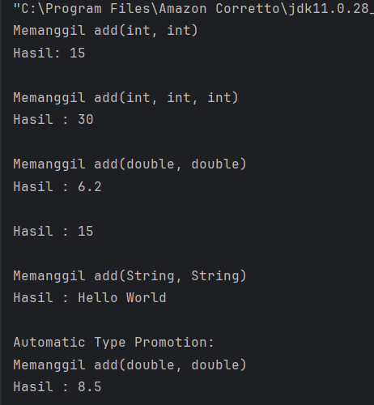
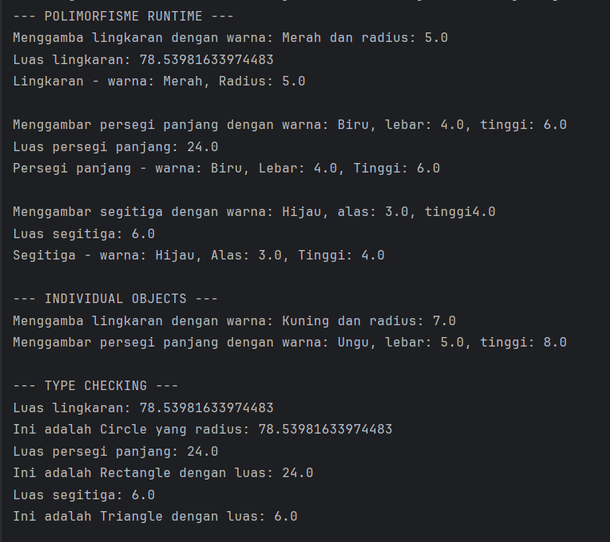

# Laporan Modul 7: Polymorphism
*Mata Kuliah:* Praktikum Pemrograman Berorientasi Objek   
*Nama:* [Muhammad Aqil Yuanza]  
*NIM:* [2024573010101]  
*Kelas:* [TI2A]

---

## BAB 1 - PENDAHULUAN
Dalam konteks pemrograman OOP (Object Oriented Programming), istilah polymorphism sering digunakan karena berkaitan erat dengan salah satu pilar seperti class, object, method, atau inheritance. Polymorphism adalah banyak bentuk atau bermacam-macam. Dalam istilah pemrograman, polymorphism adalah sebuah konsep di mana sebuah interface tunggal digunakan pada entitas yang berbeda-beda. Umumnya, penggunaan suatu simbol tunggal berfungsi untuk mewakili beberapa jenis tipe entitas.

Polymorphism adalah konsep pemrograman yang berorientasi pada objek yang mengacu pada kemampuan variabel, fungsi atau objek untuk mengambil beberapa bentuk. Polymorphism adalah penggunaan salah satu item seperti fungsi, atribut, atau interface pada berbagai jenis objek yang berbeda dalam bahasa pemrograman. Dalam bahasa pemrograman yang menunjukkan polimorfisme, objek kelas miliki hierarki yang sama yang diwariskan dari kelas induk yang sama, mungkin memiliki fungsi dengan nama yang sama, tetapi dengan perilaku berbeda.

### Tujuan Polymorphism
1. Flexibility - Memungkinkan kode yang lebih fleksibel dan mudah diperluas.
2. Code Reusability - Mengurangi duplikasi kode dengan menggunakan interface yang sama.
3. Maintainability - Memudahkan maintenance dan pengembangan fitur baru.
4. Dynamic Behavior - Perilaku objek ditentukan pada runtime
5. Interface Consistency - Konsistensi dalam penggunaan interface


### Cara Implementasi
1. Gunakan inheritance hierarchy
2. Override method di subclass
3. Gunakan reference superclass untuk memegang objek subclass
4. Method yang dipanggil ditentukan pada runtime berdasarkan tipe aktual objek


### Jenis-jenis Polimorfisme:
#### Compile-time Polymorphism (Method Overloading)

Method overriding terjadi ketika subclass (class anak) menyediakan implementasi spesifik untuk method yang sudah didefinisikan di superclass (class induk). Method overriding digunakan untuk mengubah atau memperluas perilaku method yang diwarisi dari superclass. Method yang di-override harus memiliki nama, parameter, dan return type yang sama dengan method di superclass.

#### Aturan Method Overriding:
1. Method harus memiliki nama dan parameter yang sama dengan method di superclass.
2. Return type harus sama atau subtype dari return type di superclass.
3. Access modifier tidak boleh lebih restriktif daripada method di superclass (misalnya, jika method di superclass protected, method di subclass bisa protected atau public).
4. Method tidak bisa di-override jika di superclass dideklarasikan sebagai final.


#### Runtime Polymorphism (Method Overriding)
Method overriding terjadi ketika subclass (class anak) menyediakan implementasi spesifik untuk method yang sudah didefinisikan di superclass (class induk). Method overriding digunakan untuk mengubah atau memperluas perilaku method yang diwarisi dari superclass. Method yang di-override harus memiliki nama, parameter, dan return type yang sama dengan method di superclass.


#### Aturan Method Overriding:
1. Method harus memiliki nama dan parameter yang sama dengan method di superclass.
2. Return type harus sama atau subtype dari return type di superclass.
3. Access modifier tidak boleh lebih restriktif daripada method di superclass (misalnya, jika method di superclass protected, method di subclass bisa protected atau public).
4. Method tidak bisa di-override jika di superclass dideklarasikan sebagai final.


## BAB - 2 PRAKTIKUM

### Praktikum 1: Memahami Method Overloading (Compile-time Polymorphism)

1. Buat sebuah package baru di dalam package modul_7 dengan nama praktikum_1
2. Buat class Calculator dengan method overloading:
````
package modul_7.praktikum_1;

public class Calculator {

    // method untuk menjumlahkan dua integer
    public int add(int a, int b) {
        System.out.println("Memanggil add(int, int)");
        return a + b;
    }

    // overload untuk menjumlahkan tiga integer
    public int add(int a, int b, int c) {
        System.out.println("Memanggil add(int, int, int)");
        return a + b + c;
    }

    // overload method untuk menjumlahkan dua double
    public double add(double a, double b) {
        System.out.println("Memanggil add(double, double)");
        return a + b;
    }

    // overload method untuk menjumlahkan array integer
    public int add(int[] numbers) {
        int sum = 0;
        for (int num : numbers) {
            sum += num;
        }
        return sum;
    }

    // overload method untuk concatenate strings
    public String add(String a, String b) {
        System.out.println("Memanggil add(String, String)");
        return a + b;
    }
}
````
3. Buat class OverloadingTest untuk testing:
````
package modul_7.praktikum_1;

public class OverLoadingTest {
    public static void main(String[] args) {
        Calculator calc = new Calculator();

        // test berbagai versi method add
        System.out.println("Hasil: " + calc.add(5, 10));
        System.out.println();

        System.out.println("Hasil : " + calc.add(5, 10, 15));
        System.out.println();

        System.out.println("Hasil : " + calc.add(3.5, 2.7));
        System.out.println();

        int[] numbers = {1, 2, 3, 4, 5};
        System.out.println("Hasil : " + calc.add(numbers));
        System.out.println();

        System.out.println("Hasil : " + calc.add("Hello", " World"));
        System.out.println();

        // demonstrasi automatic type promotion
        System.out.println("Automatic Type Promotion:");
        System.out.println("Hasil : " + calc.add(5, 3.5));  // int + double
    }
}

````
4. Jalankan program dan amati hasilnya
5. Perhatikan bagaimana compiler memilih method yang tepat berdasarkan parameter


### Praktikum 2: Memahami Method Overriding (Runtime Polymorphism)

1. Buat sebuah package baru di dalam package modul_7 dengan nama praktikum_2
2. Buat class Shape sebagai superclass:
````
package modul_7.praktikum_2;

public class Shape {
    protected String color;

    public Shape(String color) {
        this.color = color;
    }

    public void draw() {
        System.out.println("Menggambar shape dengan warna: " + color);
    }

    public double calculateArea() {
        System.out.println("Menghitung luas shape umum");
        return 0.0;
    }

    public void displayInfo() {
        System.out.println("Shape - warna: " + color);
    }
}
````
3. Buat class Circle yang mewarisi Shape:
````
package modul_7.praktikum_2;

public class Circle extends Shape {
    private double radius;

    public Circle(String color, double radius) {
        super(color);
        this.radius = radius;
    }

    @Override
    public void draw() {
        System.out.println("Menggamba lingkaran dengan warna: " + color + " dan radius: " + radius);
    }

    @Override
    public double calculateArea() {
        double area = Math.PI * radius * radius;
        System.out.println("Luas lingkaran: " + area);
        return area;
    }

    @Override
    public void displayInfo() {
        System.out.println("Lingkaran - warna: " + color + ", Radius: " + radius);
    }
}

````
4. Buat class Rectangle yang mewarisi Shape:
````
package modul_7.praktikum_2;

public class Rectangle extends Shape {
    private double width;
    public double height;

    public Rectangle(String color, double width, double height) {
        super(color);
        this.width = width;
        this.height = height;
    }

    @Override
    public void draw() {
        System.out.println("Menggambar persegi panjang dengan warna: " + color + ", lebar: " + width + ", tinggi: " + height);
    }

    @Override
    public double calculateArea() {
        double area = width * height;
        System.out.println("Luas persegi panjang: " + area);
        return area;
    }

    @Override
    public void displayInfo() {
        System.out.println("Persegi panjang - warna: " + color + ", Lebar: " + width + ", Tinggi: " + height);
    }
}

````
5. Buat class Triangle yang mewarisi Shape:
````
package modul_7.praktikum_2;

public class Triangle extends Shape{
    private double base;
    private double height;

    public Triangle(String color, double base, double height) {
        super(color);
        this.base = base;
        this.height = height;
    }

    @Override
    public void draw() {
        System.out.println("Menggambar segitiga dengan warna: " + color + ", alas: " + base + ", tinggi" + height);
    }

    @Override
    public double calculateArea() {
        double area = 0.5 * base * height;
        System.out.println("Luas segitiga: " + area);
        return area;
    }

    @Override
    public void displayInfo() {
        System.out.println("Segitiga - warna: " + color + ", Alas: " + base + ", Tinggi: " + height);
    }
}

````
6. Buat class PolymorphismTest untuk testing:
````
package modul_7.praktikum_2;

public class PolymorphismTest {
    public static void main(String[] args) {
        // demonstrasi runtime polymorphism
        Shape[] shapes = new Shape[3];
        shapes[0] = new Circle("Merah", 5.0);
        shapes[1] = new Rectangle("Biru", 4.0, 6.0);
        shapes[2] = new Triangle("Hijau", 3.0, 4.0);

        System.out.println("--- POLIMORFISME RUNTIME ---");
        for (Shape shape : shapes) {
            shape.draw();
            shape.calculateArea();
            shape.displayInfo();
            System.out.println();
        }

        // demonstrasi dengan individual objects
        System.out.println("--- INDIVIDUAL OBJECTS ---");
        Shape shape1 = new Circle("Kuning", 7.0);
        Shape shape2 = new Rectangle("Ungu", 5.0, 8.0);

        shape1.draw();
        shape2.draw();

        System.out.println("\n--- TYPE CHECKING ---");
        for (Shape shape : shapes) {
            if (shape instanceof Circle) {
                Circle circle = (Circle) shape;
                System.out.println("Ini adalah Circle yang radius: " + circle.calculateArea());
            }else if (shape instanceof Rectangle) {
                Rectangle rectangle = (Rectangle) shape;
                System.out.println("Ini adalah Rectangle dengan luas: " + rectangle.calculateArea());
            }else if (shape instanceof Triangle) {
                Triangle triangle = (Triangle) shape;
                System.out.println("Ini adalah Triangle dengan luas: " + triangle.calculateArea());
            }
        }
    }
}

````
7. Jalankan program dan amati:

Bagaimana method yang dipanggil ditentukan pada runtime

Perilaku polimorfik dari objek-objek berbeda

Penggunaan instanceof untuk type checking

#### Screenshot Hasil




## Kesimpulan
polymorphism dalam OOP adalah bahwa polymorphism memberikan fleksibilitas kepada program untuk memperlakukan objek yang berbeda melalui satu antarmuka yang sama. Dengan polymorphism, metode yang sama dapat menghasilkan perilaku yang berbeda tergantung pada objek yang mengimplementasikannya. Konsep ini membuat kode lebih mudah dikembangkan, diperluas, dan dipelihara karena pengembang dapat menambahkan tipe objek baru tanpa harus mengubah struktur kode yang sudah ada. Secara keseluruhan, polymorphism menjadi salah satu pilar penting dalam pemrograman berorientasi objek yang mendukung prinsip reusable dan scalable dalam pengembangan perangkat lunak.


## Referensi
https://hackmd.io/@mohdrzu/BJlT87vJZe